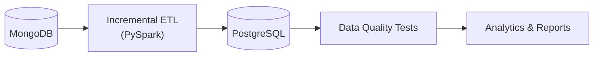

<div align="center">


# Bike Store Relational Database

An incremental data pipeline that moves retail data from **MongoDB** into **PostgreSQL**, checks it with a SQL data quality suite, and turns it into business reports.

</div>

## Architecture



Only new or changed rows move on each run Postgres itself is compared against Mongo every time, so no checkpoint files or watermark tables are needed.

## Features

- **Stateless incremental ETL** — count + `updated_at` comparison decides what to load, nothing else to configure
- **Schema evolution** — new MongoDB fields are added as Postgres columns automatically
- **Upsert logic** — updated records are refreshed in place, never duplicated
- **10-file SQL data quality suite** — nulls, uniqueness, types, referential integrity, business rules
- **21-script SQL analytics library** — exploration, reporting, cohort analysis, reusable functions
- **One-command pipeline automation** — `run_pipeline.ps1` runs the ETL and the tests back to back, with logging

## Quick Start

```bash
git clone <repo-url>
cd bike-store-relational-database
uv sync

# add Postgres + Mongo credentials to .env — see docs/run_book.md

# first-time full load
uv run python scripts/mongo_to_postgres.py --full-refresh

# every run after that — ETL + data quality tests in one go
pipeline\run_pipeline.ps1
```

## Project Structure

```
├── assets/        — README images (logos)
├── docs/          — architecture & operational docs
├── pipeline/      — run_pipeline.ps1 orchestrator
├── scripts/       — mongo_to_postgres.py (ETL)
├── sql/           — 21 analytical SQL scripts
├── tests/         — 10-file SQL data quality suite
├── utils/         — shared connection / engine / logger modules
├── charts/        — pre-generated PNG visualizations
├── reports/       — pre-generated Markdown business reports
├── health_check.py
├── main.py
└── .env           — not committed
```

## Documentation

This README keeps things brief — everything else lives in `docs/`:

| Doc | What's in it |
|---|---|
| [docs/ARCHITECTURE.md](docs/ARCHITECTURE.md) | Visual system overview, Mermaid diagrams |
| [docs/data_catlog.md](docs/data_catlog.md) | Full schema reference for all 9 tables |
| [docs/incremental_loading.md](docs/incremental_loading.md) | How the ETL's incremental logic works, step by step |
| [docs/data_quality_checks.md](docs/data_quality_checks.md) | What each SQL test checks and why |
| [docs/run_book.md](docs/run_book.md) | How to run, configure, and troubleshoot |
