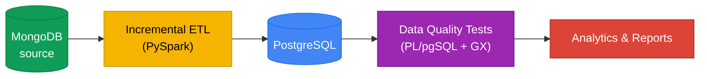

<div align="center">


# Bike Store Relational Database

An incremental data pipeline that moves retail data from **MongoDB** into **PostgreSQL**, checks it with a SQL data quality suite, and turns it into business reports.

</div>

## Architecture



Only new or changed rows move on each run. Postgres itself is compared against Mongo every time, so no checkpoint files or watermark tables are needed.

## Features

- **Stateless incremental ETL** — count + `updated_at` comparison decides what to load, nothing else to configure
- **Schema evolution** — new MongoDB fields are added as Postgres columns automatically
- **Upsert logic** — updated records are refreshed in place, never duplicated
- **10-file PL/pgSQL data quality suite** — nulls, uniqueness, types, referential integrity, business rules
- **21-script SQL analytics library** — exploration, reporting, cohort analysis, reusable functions
- **One-command pipeline automation** — `ps1/local_runner.ps1` runs ETL + tests with logging

## Quick Start

```bash
git clone https://github.com/Nitinx12/Bike-Store-Relational-Database
cd bike-store-relational-database

# Install dependencies
uv sync

# Set up credentials
cp .env.example .env   # edit .env with your Postgres + MongoDB credentials

# Full first-time load
uv run python -m scripts.mongo_to_postgres --full-refresh

# Run the full pipeline (ETL + PL/pgSQL + GX) via PowerShell
.\ps1\local_runner.ps1
```

Or use Docker:

```bash
make build
make up
make pipeline
```

## Project Structure

```
bike-store-relational-database/
├── docker/          — Dockerfile, entrypoint.sh, Prometheus config
├── docs/            — Architecture, run book, data catalog, testing guide
├── gx/              — Great Expectations suites (9 table expectations)
├── jars/            — PostgreSQL JDBC driver
├── ps1/             — PowerShell automation (local_runner.ps1)
├── scripts/         — ETL, DQ, schema inspection, infrastructure scripts
├── sql/             — 21 analytical SQL scripts
├── src/             — Pipeline, database, validation, and utility modules
│   ├── pipeline/    — config, decision, spark_session, transform, mongo_source, runner
│   ├── database/    — jdbc_writer, schema, staging, stats
│   ├── validation/  — plpgsql_loops wrapper
│   └── utils/       — connection, engine, logger, metrics
├── tests/
│   ├── data_quality/    — Python Great Expectations runner
│   └── generic/loops/   — 10 PL/pgSQL DO-block test files
├── docker-compose.yml    — Full stack: postgres, mongodb, pushgateway, prometheus, grafana, app
├── Makefile              — One-command pipeline automation
├── pyproject.toml        — uv dependency manifest
└── .env.example          — Environment variable template
```

## Documentation

| Doc | What's in it |
|---|---|
| [docs/ARCHITECTURE.md](docs/ARCHITECTURE.md) | Visual system overview, Mermaid diagrams, container topology |
| [docs/run_book.md](docs/run_book.md) | How to run, configure, and troubleshoot |
| [docs/data_catlog.md](docs/data_catlog.md) | Full schema reference for all 9 tables |
| [docs/incremental_loading.md](docs/incremental_loading.md) | How the ETL's incremental logic works, step by step |
| [docs/testing.md](docs/testing.md) | Data quality strategy, suite overview |
| [docs/docker.md](docs/docker.md) | Docker setup, image build, docker-compose services |
| [docs/monitoring.md](docs/monitoring.md) | Prometheus, Pushgateway, Grafana observability stack |
| [docs/project_structure.md](docs/project_structure.md) | Full file-tree breakdown with descriptions |
| [docs/SQL.md](docs/SQL.md) | SQL analytics library overview (21 scripts) |
| [docs/scripts.md](docs/scripts.md) | All scripts documented with run modes and diagrams |
| [docs/utils.md](docs/utils.md) | Utility modules reference |
| [docs/tests.md](docs/tests.md) | Test suite overview |
