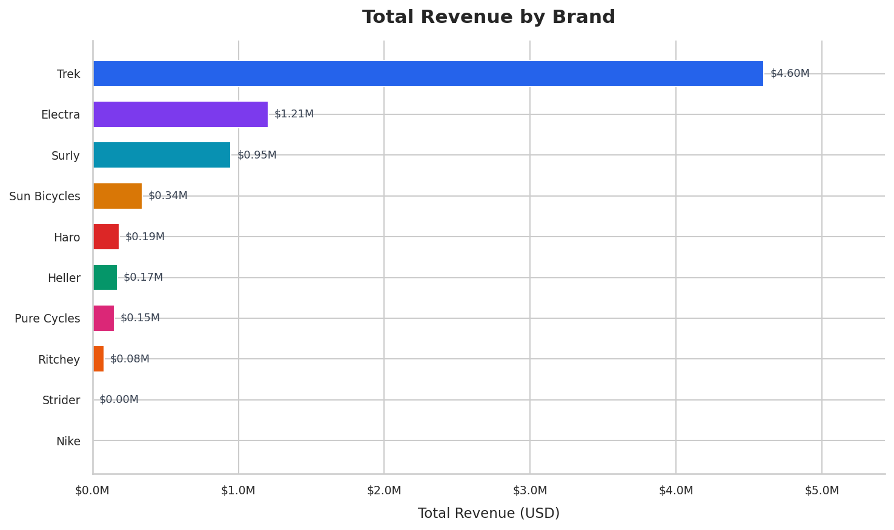
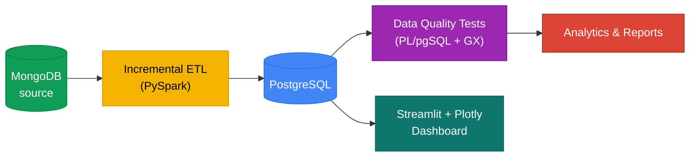
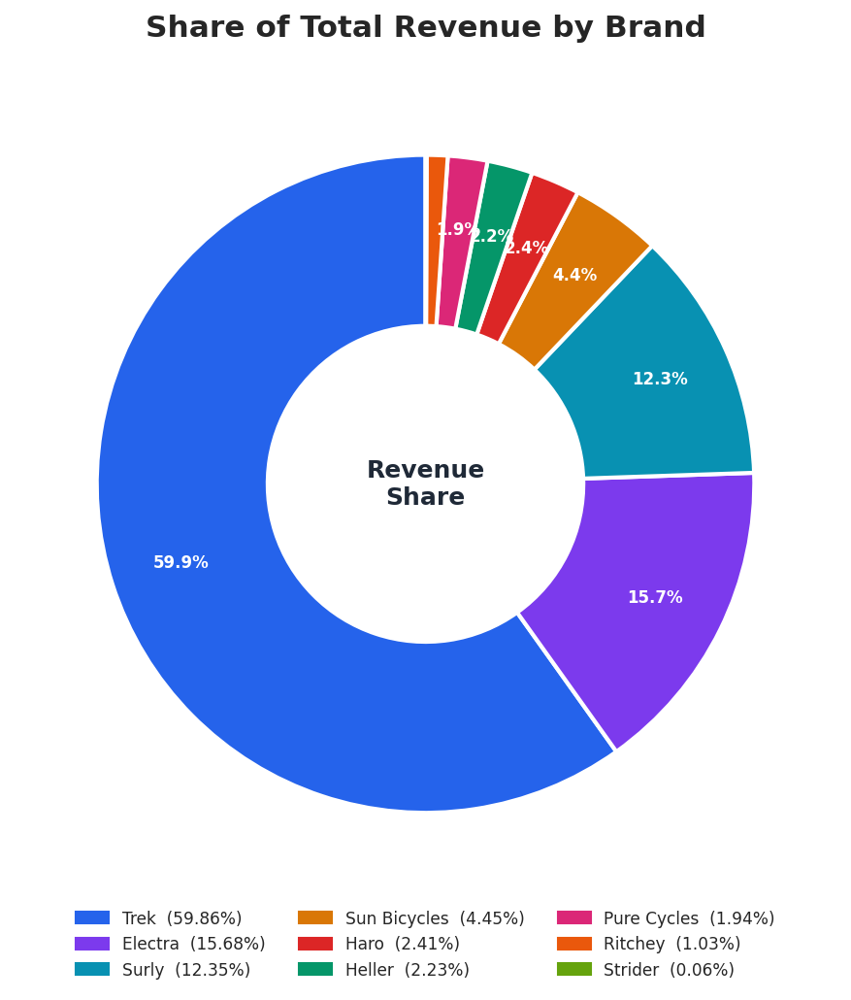
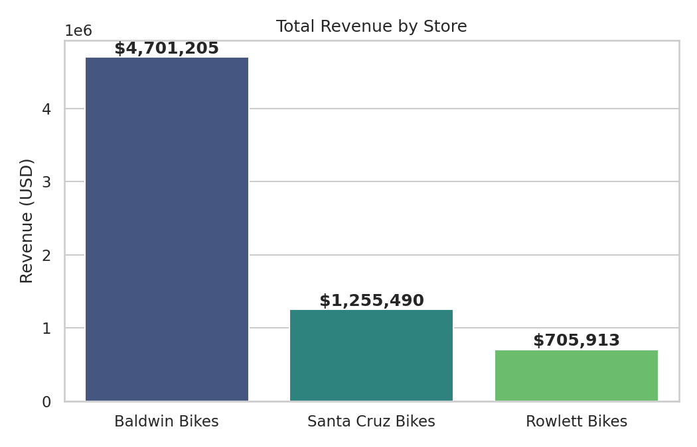
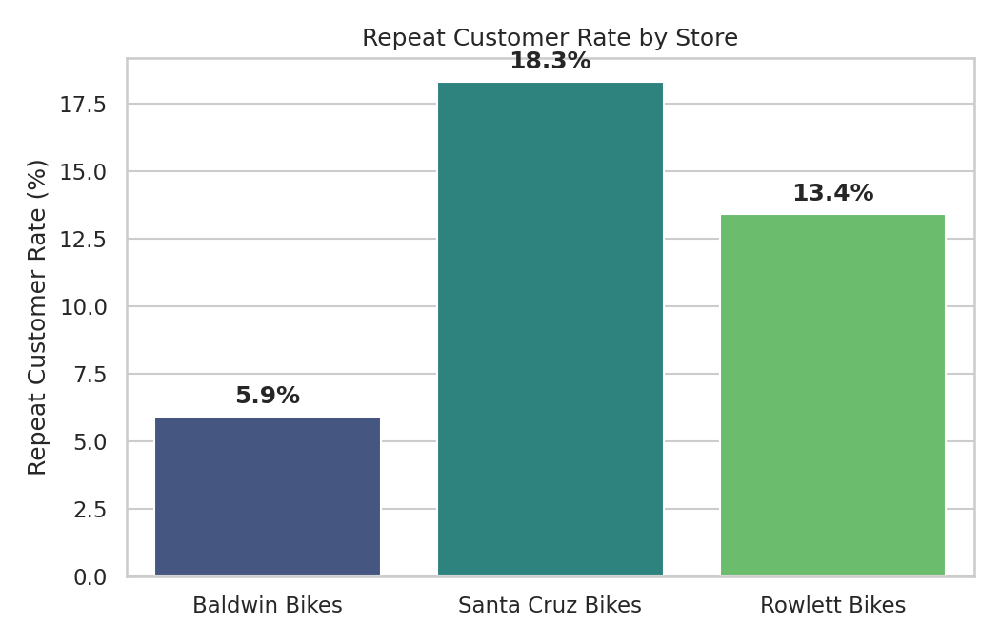

<div align="center">

<!-- ── Banner / Logo ── -->


# Bike Store Relational Database

**Incremental ETL • SQL Analytics • Live Dashboard**

Incremental data pipeline moving retail data from **MongoDB** to **PostgreSQL**, validated by a SQL data quality suite and surfaced through business reports and a live dashboard.

<!-- ── Badges (shields.io + skillicons + streamlit) — keep on one visual row ── -->
[](pyproject.toml)
[](https://ubuntu.com)
[](https://spark.apache.org)
[](https://www.postgresql.org)
[](https://www.mongodb.com)
[](streamlit_app.py)
[](https://plotly.com)
[](LICENSE)
[](https://github.com/Nitinx12/Bike-Store-Relational-Database/releases)
[](https://github.com/Nitinx12/Bike-Store-Relational-Database/actions)
[](https://github.com/astral-sh/ruff)
[](.pre-commit-config.yaml)

[](https://discord.com)
[](https://www.linkedin.com/in/nitinx12)
[](https://twitter.com)
[](https://github.com/vinta/awesome-python)

[](https://bike-store-relational-database-grvahmynq59w6zgckat2hx.streamlit.app/)


</div>

---

## ✨ Live Demo

> **Public dashboard — no localhost needed.**
> On Streamlit Cloud without `postgres` secrets it auto-uses `dashboard/sample/*.csv` demo data. With secrets it hits your live Postgres.

<p align="center">
  <a href="https://bike-store-relational-database-grvahmynq59w6zgckat2hx.streamlit.app/">
    
  </a>
</p>

---

## Architecture



Stateless incremental load — PostgreSQL is compared against MongoDB by row count + `updated_at` on every run. No watermark tables, no checkpoint files.

---

## Features

| Area | Highlights |
|---|---|
| **ETL** | PySpark `local[*]`, `updated_at` incremental, auto schema evolution, `ON CONFLICT … DO UPDATE WHERE EXCLUDED.updated_at >` upsert, staging `_row_hash` dedup |
| **Quality** | 10-file PL/pgSQL loop suite + Great Expectations (9 suites) — nulls, uniqueness, FK, business rules |
| **Analytics** | 21-script SQL library — exploration, ranking, cohort, `fn_store_performance`, `fn_inventory_summary` |
| **Dashboard** | Streamlit + Plotly 5-tab ops view (`st.cache_data` TTL 5 min, `st.secrets` → `.env` fallback, sample CSV demo) — [Live](https://bike-store-relational-database-grvahmynq59w6zgckat2hx.streamlit.app/) |
| **Ops** | Makefile `check-deps`/`doctor`, Docker + `uv`, Prometheus/Pushgateway/Grafana, `CODEOWNERS` + `pre-commit` + branch protection |

---

## Quick Start

```bash
git clone https://github.com/Nitinx12/Bike-Store-Relational-Database
cd bike-store-relational-database

uv sync                              # install deps (uv, NOT pip)
cp .env.example .env                 # add Postgres + Mongo credentials
make doctor                          # verify setup
make run                             # ETL + PL/pgSQL + GX
make dashboard                       # → http://localhost:8501
```

With Docker:

```bash
make build && make up && make pipeline
```

First run is a full load; every run after is incremental.

---

## Key Makefile Commands

| Target | What it does |
|---|---|
| `make run` | Full pipeline (ETL + DQ + GX) — recommended |
| `make run-etl` | ETL only |
| `make run-dq` / `make run-gx` | PL/pgSQL / GX only |
| `make doctor` | Pre-flight health check |
| `make lint` / `make test` / `make format` | Ruff, Mypy, SQLFluff / pytest / format |
| `make up` / `make down` | Start / stop Docker stack |
| `make dashboard` | Streamlit locally |
| `make dashboard-guard` | Guard — fail if any change breaks dashboard |
| `make backup-postgres` / `make backup-mongo` | Backups |

Full reference: [`docs/makefile.md`](docs/makefile.md)

---

## Project Structure

```
bike-store-relational-database/
├── streamlit_app.py      — Streamlit entry (Cloud main file)
├── dashboard/            — data.py (secrets→env→sample), charts.py (Plotly)
│   └── sample/           — pre-exported CSVs for public demo fallback
├── .streamlit/           — config.toml (teal theme) + secrets.toml.example
├── docker/               — Dockerfile, entrypoint.sh, Prometheus
├── docs/                 — run_book, data_catalog, incremental_loading, dashboard.md
├── ps1/                  — PowerShell automation
├── scripts/              — ETL, DQ, schema, infra
├── sql/                  — 21 analytics scripts
├── src/                  — pipeline, database, validation, utils
├── tests/                — GX runner + 10 PL/pgSQL loops + unit (incl. dashboard)
├── docker-compose.yml
├── Makefile
├── pyproject.toml
└── .env.example
```

---

## Screenshots

<p align="center">
  
  
  
</p>

---

## Documentation

| Doc | What's in it |
|---|---|
| [docs/ARCHITECTURE.md](docs/ARCHITECTURE.md) | System overview, diagrams, container topology |
| [docs/run_book.md](docs/run_book.md) | Running, configuring, troubleshooting |
| [docs/makefile.md](docs/makefile.md) | Complete Makefile reference |
| [docs/data_catalog.md](docs/data_catalog.md) | Schema for all 9 tables |
| [docs/incremental_loading.md](docs/incremental_loading.md) | How incremental works |
| [docs/testing.md](docs/testing.md) | Quality strategy |
| [docs/dashboard.md](docs/dashboard.md) | Dashboard deploy guide |
| [CHANGELOG.md](CHANGELOG.md) | Release history |

---

## Contributing

1. `git checkout -b feat/your-feature`
2. `make format && make lint && make test && make doctor`
3. `git commit -m "feat: describe your change"` — Conventional Commits enforced by `.githooks/commit-msg`
4. Open a PR — `CODEOWNERS` + `Dashboard guard` + `CI` must pass

See [AGENTS.md](AGENTS.md) for conventions.
