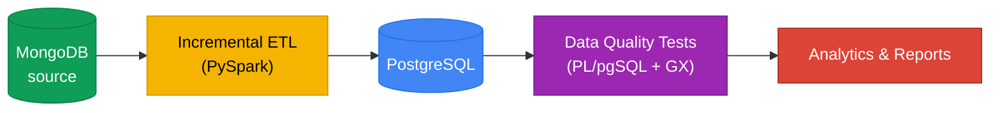

<div align="center">


# Bike Store Relational Database

An incremental data pipeline that moves retail data from **MongoDB** into **PostgreSQL**, checks it with a SQL data quality suite, and turns it into business reports.

</div>

---

## Table of Contents

- [Architecture](#architecture)
- [Features](#features)
- [Quick Start](#quick-start)
- [Makefile Commands](#makefile-commands)
- [Developer Workflow](#developer-workflow)
- [Project Structure](#project-structure)
- [Documentation](#documentation)
- [Contributing](#contributing)

---

## Architecture



Only new or changed rows move on each run. Postgres itself is compared against Mongo every time, so no checkpoint files or watermark tables are needed.

---

## Features

- **Stateless incremental ETL** — count + `updated_at` comparison decides what to load, nothing else to configure
- **Schema evolution** — new MongoDB fields are added as Postgres columns automatically
- **Upsert logic** — updated records are refreshed in place, never duplicated
- **10-file PL/pgSQL data quality suite** — nulls, uniqueness, types, referential integrity, business rules
- **21-script SQL analytics library** — exploration, reporting, cohort analysis, reusable functions
- **One-command pipeline automation** — `make run` orchestrates ETL + tests with logging
- **Production-grade Makefile** — `check-deps`, `doctor`, and per-stage run targets
- **Dual-mode execution** — Local (fast dev with `uv`) and Docker (consistent environment)

---

## Quick Start

```bash
git clone https://github.com/Nitinx12/Bike-Store-Relational-Database
cd bike-store-relational-database

# Install dependencies (uses uv, NOT pip)
uv sync

# Set up credentials
cp .env.example .env   # edit .env with your Postgres + MongoDB credentials

# Verify everything is wired up
make doctor

# Run the full pipeline (ETL + PL/pgSQL + Great Expectations in one process)
make run
```

Or use Docker for a fully managed stack:

```bash
make build       # build the app image
make up          # start Postgres, MongoDB, monitoring
make pipeline    # run the full pipeline inside Docker
```

The first run loads every collection from MongoDB into Postgres. Every subsequent run is incremental and only moves new or updated rows.

---

## Makefile Commands

The Makefile is the project's main entry point. All run targets use `uv run` so dependencies are always resolved from `pyproject.toml` and the venv — never invoke the interpreter directly.

> Run `make help` on your machine to see the live, formatted output.

### Quick Start targets

| Target | What it does |
| :--- | :--- |
| `make run` | Run the full pipeline in-process (ETL + PL/pgSQL + GX) — **recommended default** |
| `make run-verbose` | Same as `run`, with full Python tracebacks |
| `make run-full` | Full refresh — truncate and reload every collection |
| `make install` | `uv sync` and verify dependencies |
| `make doctor` | Pre-flight check: uv lockfile + Python imports of all 3 pipeline modules |
| `make check-deps` | Quick `uv` and lockfile sanity check (run before any pipeline target) |

### Per-stage targets

| Target | What it does |
| :--- | :--- |
| `make run-etl` | Run only the ETL stage (MongoDB → Postgres) |
| `make run-dq` | Run only the PL/pgSQL data-quality suite |
| `make run-gx` | Run only the Great Expectations suite |
| `make run-etl-only` | ETL + skip all validation (fast dev loop) |
| `make run-etl-dq` | ETL + PL/pgSQL, skip GX |

### Collection-level targets

| Target | Usage |
| :--- | :--- |
| `make run-collection` | `make run-collection ARGS="--collection orders"` |
| `make run-collection-full` | `make run-collection-full ARGS="--collection orders"` |
| `make run-gx-table` | `make run-gx-table GX_TABLES="orders products"` |

### Docker and local-pipeline targets

| Target | What it does |
| :--- | :--- |
| `make up` | Start Postgres, MongoDB, Pushgateway, Prometheus, Grafana |
| `make down` | Stop the Docker stack |
| `make pipeline` | Full pipeline inside Docker |
| `make local-pipeline` | Full pipeline via PowerShell (rich terminal UI, per-stage logs) |
| `make build` | Build the Docker app image |
| `make shell` | Open a shell inside the app container |
| `make clean` | Remove containers and volumes |

### Quality assurance

| Target | What it does |
| :--- | :--- |
| `make lint` | Run Ruff, Mypy, and SQLFluff |
| `make test` | Run pytest |
| `make format` | Format code with Ruff |

### Utilities

| Target | What it does |
| :--- | :--- |
| `make run-clean` | Remove pipeline logs older than 7 days |
| `make backup-postgres` | Backup Postgres database |
| `make restore-postgres` | Restore Postgres from a backup |
| `make backup-mongo` | Backup MongoDB |
| `make restore-mongo` | Restore MongoDB |
| `make health-check` | Liveness probe for Postgres and MongoDB |
| `make seed` | Seed MongoDB with sample data |
| `make local-seed` | Seed MongoDB locally (no Docker) |
| `make monitor-logs` | Manage Docker pipeline logs |
| `make log-cleanup` | Local log cleanup |

> See [`docs/makefile.md`](docs/makefile.md) for the complete reference, including advanced usage and examples.

---

## Developer Workflow

This project supports dual-mode execution: **Local** (fast development) and **Docker** (consistent environment).

### Local Development (Non-Docker)
Requires `uv` and `PowerShell` installed.

1. **Setup**
   ```bash
   uv sync
   cp .env.example .env   # edit .env with credentials
   make doctor            # verify the install is healthy
   ```

2. **Run the pipeline**
   ```bash
   make run                                # full pipeline
   make run-etl                            # ETL only
   make run-full                           # full refresh
   make run-collection ARGS="--collection orders"   # one collection
   ```

3. **Quality**
   ```bash
   make lint    # Ruff, Mypy, SQLFluff
   make test    # Pytest
   make format  # Auto-format with Ruff
   ```

### Dockerized Development

```bash
make build                                # build app image
make up                                   # start the stack
make pipeline                             # full pipeline in Docker
make local-pipeline                       # full pipeline via PowerShell
```

### Summary Table

| Action | Docker Target | Local Target | Tool Used |
| :--- | :--- | :--- | :--- |
| Run full pipeline | `make pipeline` | `make run` / `make local-pipeline` | `uv` / `pwsh` |
| Run ETL | `make etl` | `make run-etl` | `uv` / `python` |
| Run PL/pgSQL tests | `make dq-loops` | `make run-dq` | `uv` / `python` |
| Run Great Expectations | `make dq-gx` | `make run-gx` | `uv` / `python` |
| Lint code | `make lint` | `make lint` | `ruff` / `sqlfluff` |
| Health check | `make health-check` | `make doctor` | `bash` / `uv` |

---

## Project Structure

```
bike-store-relational-database/
├── docker/          — Dockerfile, entrypoint.sh, Prometheus config
├── docs/            — Architecture, run book, data catalog, testing guide
├── gx/              — Great Expectations legacy config (suites are code-first in tests/data_quality/suites/)
├── jars/            — PostgreSQL JDBC driver
├── ps1/             — PowerShell automation (local_runner.ps1)
├── scripts/         — ETL, DQ, schema inspection, infrastructure scripts
├── sql/             — 21 analytical SQL scripts
├── src/             — Pipeline, database, validation, and utility modules
│   ├── pipeline/    — config, decision, spark_session, transform, mongo_source, runner
│   ├── database/    — jdbc_writer, schema, staging, stats
│   ├── validation/  — plpgsql_loops wrapper
│   └── utils/       — connection, engine, logger, metrics
├── tests/
│   ├── data_quality/    — Python Great Expectations runner
│   └── generic/loops/   — 10 PL/pgSQL DO-block test files
├── docker-compose.yml    — Full stack: postgres, mongodb, pushgateway, prometheus, grafana, app
├── Makefile              — One-command pipeline automation
├── pyproject.toml        — uv dependency manifest
└── .env.example          — Environment variable template
```

---

## Documentation

| Doc | What's in it |
|---|---|
| [docs/ARCHITECTURE.md](docs/ARCHITECTURE.md) | Visual system overview, Mermaid diagrams, container topology |
| [docs/run_book.md](docs/run_book.md) | How to run, configure, and troubleshoot |
| [docs/makefile.md](docs/makefile.md) | **Complete Makefile reference** — every target with examples |
| [docs/data_catalog.md](docs/data_catalog.md) | Full schema reference for all 9 tables |
| [docs/incremental_loading.md](docs/incremental_loading.md) | How the ETL's incremental logic works, step by step |
| [docs/testing.md](docs/testing.md) | Data quality strategy, suite overview |
| [docs/docker.md](docs/docker.md) | Docker setup, image build, docker-compose services |
| [docs/monitoring.md](docs/monitoring.md) | Prometheus, Pushgateway, Grafana observability stack |
| [docs/project_structure.md](docs/project_structure.md) | Full file-tree breakdown with descriptions |
| [docs/SQL.md](docs/SQL.md) | SQL analytics library overview (21 scripts) |
| [docs/scripts.md](docs/scripts.md) | All scripts documented with run modes and diagrams |
| [docs/utils.md](docs/utils.md) | Utility modules reference |
| [docs/tests.md](docs/tests.md) | Test suite overview |
| [CHANGELOG.md](CHANGELOG.md) | Release history of all notable changes |

---

## Contributing

1. Fork and clone the repository.
2. Create a feature branch: `git checkout -b feat/your-feature`.
3. Make your changes.
4. Run quality checks locally:
   ```bash
   make format
   make lint
   make test
   make doctor
   ```
5. Commit using [Conventional Commits](https://www.conventionalcommits.org/):
   ```bash
   git commit -m "feat: describe your change"
   ```
6. Open a Pull Request.

See [AGENTS.md](AGENTS.md) for project conventions and coding standards.
