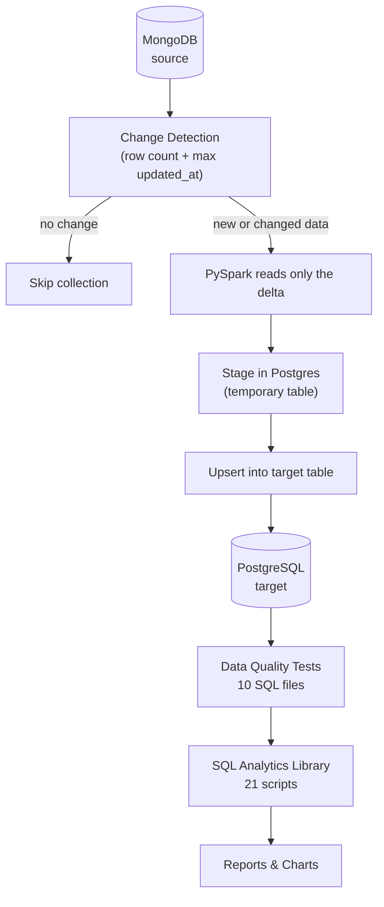
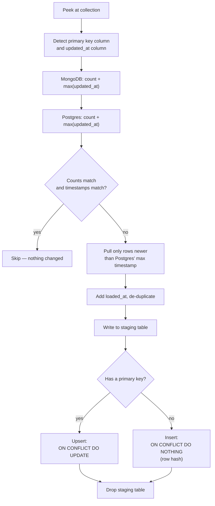
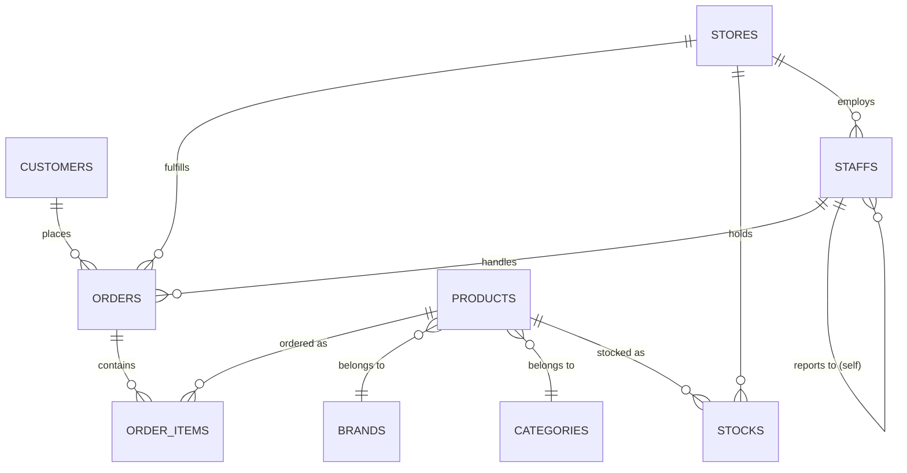
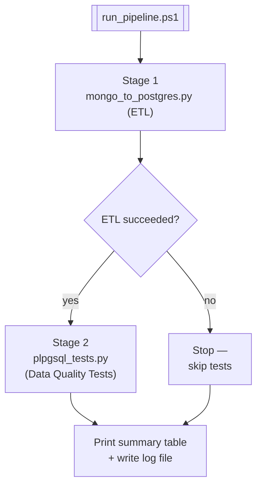

# Architecture

This project moves retail data from **MongoDB** to **PostgreSQL** on a schedule, checks it for quality, then turns it into reports. This page is the simple, visual entry point for column-level detail, see [`data_catlog.md`](./data_catlog.md), [`incremental_loading.md`](./incremental_loading.md), and [`run_book.md`](./run_book.md).

---

## 1. System at a Glance

One collection can be skipped while another loads — each of the 9 collections goes through this decision independently, every run.

---

## 2. How the ETL Decides What to Load

This is the part that makes it "incremental" no checkpoint files, no watermark tables. PostgreSQL's own data is compared against MongoDB every time.

`--full-refresh` skips straight from the top to step **G**, reading everything instead of just the delta.

---

## 3. Data Model

Nine tables, three layers: reference data (`brands`, `categories`), operational masters (`customers`, `stores`, `staffs`, `products`), and transactions (`orders`, `order_items`, `stocks`).

`order_items` and `stocks` are the two junction tables with composite keys — everything else has a plain `<table>_id` primary key.

---

## 4. Pipeline Automation

`pipeline/run_pipeline.ps1` runs the ETL and the test suite back to back, so a single command gives you a load-and-verify cycle.

`-ContinueOnError` overrides the stop-on-failure behavior if you want the tests to run against data that failed to load anyway.

---

## Known Limitations

A few things this architecture intentionally does **not** handle — see `incremental_loading.md` for the full explanation of each:

- **No delete propagation** — rows deleted in MongoDB stay in Postgres. The orphan checks in test file `06` are what catch this.
- **`order_items` composite key** — the ETL's auto-detection only finds single-column keys, so this table needs separate handling.
- **Same-timestamp edge case** — a row sharing the exact max `updated_at` with Postgres can be missed; a targeted `--full-refresh` fixes it.
- **Everything is stored as `TEXT`** — type and range validation happens entirely in the test suite, not the database schema.