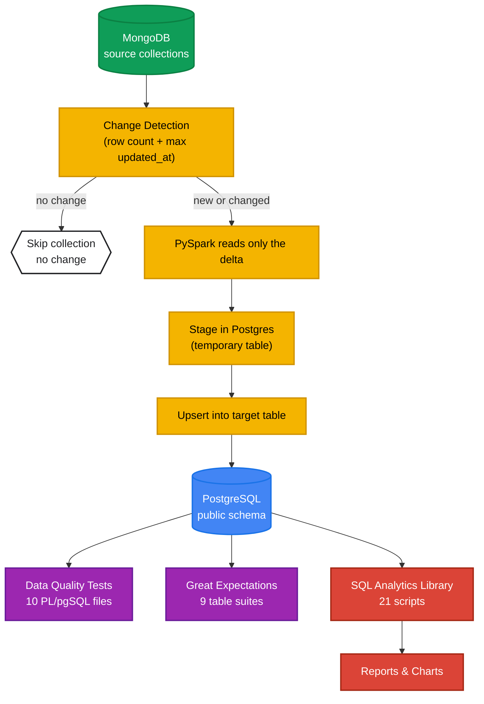
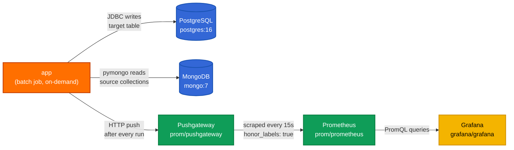
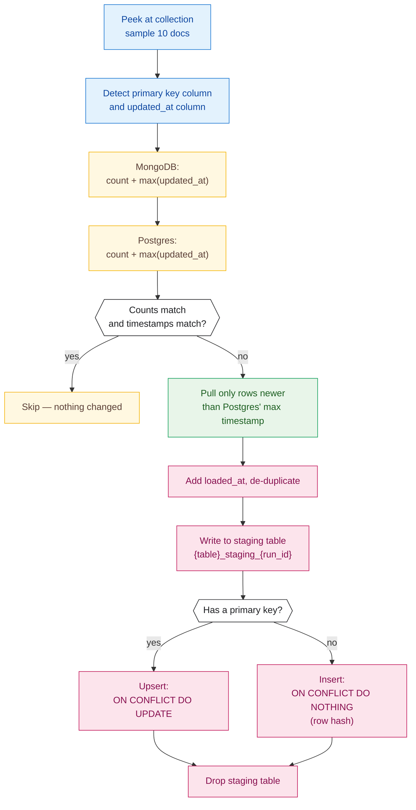
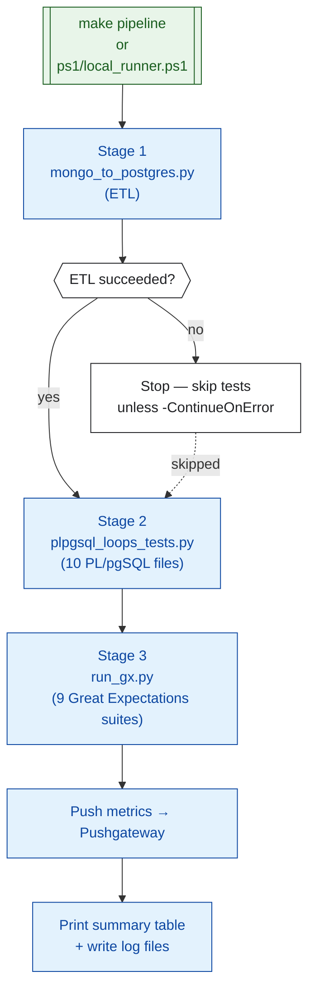
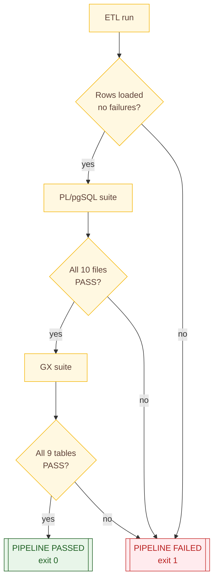

# Architecture

This project moves retail data from **MongoDB** to **PostgreSQL** on a schedule, checks it for quality, then turns it into reports. This page is the simple, visual entry point. For column-level detail, see [`data_catlog.md`](./data_catlog.md), [`incremental_loading.md`](./incremental_loading.md), and [`run_book.md`](./run_book.md).

---

## 1. System at a Glance



One collection can be skipped while another loads — each of the 9 collections goes through this decision independently, every run.

---

## 2. Container Topology



All services share one `monitoring` Docker network and reach each other by hostname.

---

## 3. How the ETL Decides What to Load

This is the part that makes it "incremental" — no checkpoint files, no watermark tables. PostgreSQL's own data is compared against MongoDB every time.



`--full-refresh` skips straight from the top to step **G**, reading everything instead of just the delta.

---

## 4. Data Model

Nine tables, three layers: reference data (`brands`, `categories`), operational masters (`customers`, `stores`, `staffs`, `products`), and transactions (`orders`, `order_items`, `stocks`).

```mermaid
erDiagram
    classDef ref fill:#fff3e0,stroke:#e65100,color:#3e2723
    classDef master fill:#e8f5e9,stroke:#1b5e20,color:#1b5e20
    classDef txn fill:#e3f2fd,stroke:#0d47a1,color:#0d47a1
    classDef junction fill:#fce4ec,stroke:#880e4f,color:#880e4f

    BRANDS ||--o{ PRODUCTS : "owns":::master
    CATEGORIES ||--o{ PRODUCTS : "owns":::master
    CUSTOMERS ||--o{ ORDERS : "places":::master
    STAFFS ||--o{ ORDERS : "handles":::master
    STORES ||--o{ ORDERS : "fulfills":::master
    STORES ||--o{ STAFFS : "employs":::master
    STORES ||--o{ STOCKS : "holds":::master
    PRODUCTS ||--o{ STOCKS : "stocked at":::master
    PRODUCTS ||--o{ ORDER_ITEMS : "appears in":::master
    ORDERS ||--o{ ORDER_ITEMS : "contains":::master
    STAFFS ||--o{ STAFFS : "manages":::master

    BRANDS {
        bigint brand_id PK
        text   brand_name
        timestamp updated_at
    }
    CATEGORIES {
        bigint category_id PK
        text   category_name
        timestamp updated_at
    }
    CUSTOMERS {
        bigint customer_id PK
        text   first_name
        text   last_name
        text   email
        timestamp updated_at
    }
    STORES {
        bigint store_id PK
        text   store_name
        text   city
        timestamp updated_at
    }
    STAFFS {
        bigint staff_id PK
        bigint store_id FK
        bigint manager_id FK
        text   active
        timestamp updated_at
    }
    PRODUCTS {
        bigint product_id PK
        bigint brand_id FK
        bigint category_id FK
        numeric list_price
        timestamp updated_at
    }
    ORDERS {
        bigint order_id PK
        bigint customer_id FK
        bigint store_id FK
        bigint staff_id FK
        date   order_date
        text   order_status
        timestamp updated_at
    }
    ORDER_ITEMS {
        bigint order_id PK,FK
        bigint item_id PK
        bigint product_id FK
        bigint quantity
        numeric list_price
        numeric discount
        numeric total_value
        timestamp updated_at
    }
    STOCKS {
        bigint store_id PK,FK
        bigint product_id PK,FK
        bigint quantity
        timestamp updated_at
    }
```

`order_items` and `stocks` are the two junction tables with composite keys — everything else has a plain `<table>_id` primary key.

---

## 5. Pipeline Automation

Two equivalent entry points run the full load-and-verify cycle:

- **`make pipeline`** → `docker compose --profile jobs run --rm app pipeline` (one image, all stages)
- **`ps1/local_runner.ps1`** → native PowerShell, three stages, optional `-ContinueOnError`



---

## 6. Quality-Gate Decision Tree

The data-quality layer enforces a strict invariant: **every CI run must end with all three suites green**, or it blocks deployment.



---

## Known Limitations

A few things this architecture intentionally does **not** handle — see `incremental_loading.md` for the full explanation of each:

- **No delete propagation** — rows deleted in MongoDB stay in Postgres. The orphan checks in test file `06` are what catch this.
- **`order_items` composite key** — the ETL's auto-detection only finds single-column keys, so this table needs separate handling.
- **Same-timestamp edge case** — a row sharing the exact max `updated_at` with Postgres can be missed; a targeted `--full-refresh` fixes it.
- **Everything is stored as `TEXT`** — type and range validation happens entirely in the test suite, not the database schema.