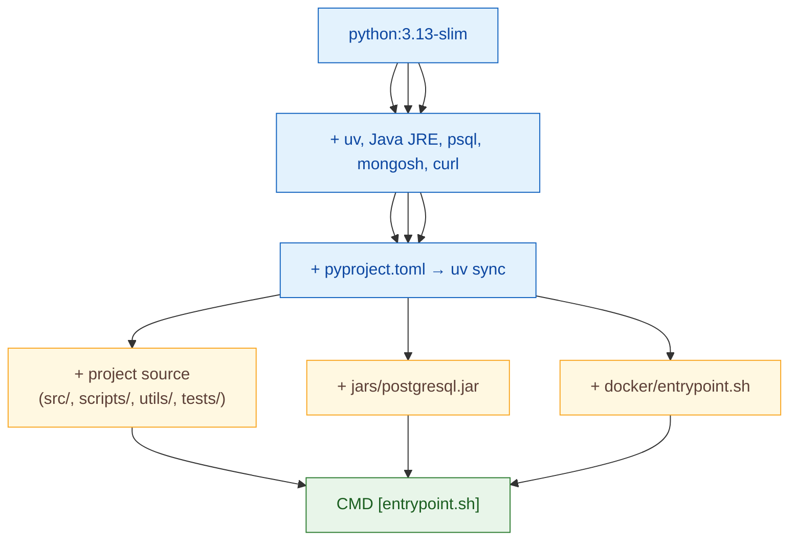
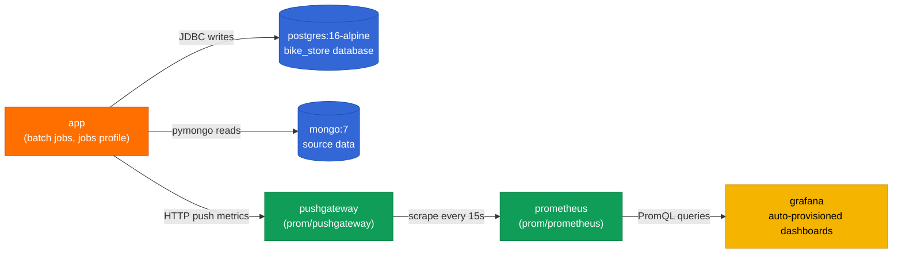
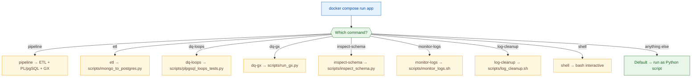

# Docker

The pipeline runs as a multi-container stack. This document explains the image build, service composition, and how to extend it.

---

## Image: `docker/Dockerfile`

The single application image hosts all batch jobs. It's based on `python:3.13-slim` (matches `pyproject.toml` `requires-python = ">=3.13"`) and is built in three stages:



### Why these base tools

- **Java JRE** — PySpark requires a JVM
- **psql** — used by backup/restore and `monitor_logs.sh` health probes
- **mongosh** — used by `docker_dev.sh` and `monitor_logs.sh` MongoDB checks
- **curl** — Prometheus / Pushgateway health probes

### Build it

```bash
make build                          # via Makefile
docker compose build app            # direct
docker build -t bike-store-app docker/  # raw
```

---

## Stack: `docker-compose.yml`

Six services on one `monitoring` network. Profiles separate long-running infrastructure from on-demand batch jobs.



### Services

| Service | Image | Port | Healthcheck |
|---|---|---|---|
| `postgres` | `postgres:16-alpine` | 5432 | `pg_isready` |
| `mongodb` | `mongo:7` | 27017 | `mongosh ping` |
| `pushgateway` | `prom/pushgateway` | 9091 | HTTP `/-/healthy` |
| `prometheus` | `prom/prometheus` | 9090 | HTTP `/-/healthy` |
| `grafana` | `grafana/grafana` | 3000 | HTTP `/api/health` |
| `app` | local (`docker/Dockerfile`) | — | jobs profile (on-demand) |

### Profiles

Only `app` uses profiles. `app` is in the `jobs` profile, so it does **not** start with `make up` — it's launched on demand with `make pipeline`, `make etl`, etc.

```yaml
services:
  app:
    profiles: ["jobs"]
    command: ["entrypoint.sh"]   # dispatches to the requested job
```

### Endpoints (after `make up`)

| Service | URL | Default credentials |
|---|---|---|
| Grafana | http://localhost:3000 | `admin` / `${GRAFANA_ADMIN_PASSWORD}` |
| Prometheus | http://localhost:9090 | none |
| Pushgateway | http://localhost:9091 | none |

### Volumes

| Volume | Backed by | Survives `docker compose down`? |
|---|---|---|
| `postgres_data` | `/var/lib/postgresql/data` | yes |
| `mongodb_data` | `/data/db` | yes |
| `prometheus_data` | `/prometheus` | yes |
| `grafana_data` | `/var/lib/grafana` | yes |

Use `make clean` to remove containers + volumes, or `make prune` to nuke everything including images and build cache.

---

## Entry point: `docker/entrypoint.sh`

Dispatches the `docker compose run app <command>` invocation to the correct script. Acts as the bridge between compose services and the project scripts.



---

## `.dockerignore`

Excludes local-only files from the build context:
- `__pycache__/`, `.venv/`, `.env` (secrets)
- `.git/` (history)
- `logs/`, `reports/` (artifacts)
- `tests/generic/loops/*.sql` is **not** excluded (PL/pgSQL test files are loaded into the container for the dq-loops job)

---

## Extending the stack

### Add a new service (e.g. Redash, Metabase)

1. Add the service block to `docker-compose.yml` in the `monitoring` network
2. Add a `healthcheck:` (so dependent services wait for it)
3. Document in [docs/ARCHITECTURE.md](ARCHITECTURE.md) Container Topology section

### Add a new job

1. Add a `cmd_<jobname>` branch to `docker/entrypoint.sh`
2. Add a `make <jobname>` target in the Makefile
3. Document in [docs/run_book.md](run_book.md)
