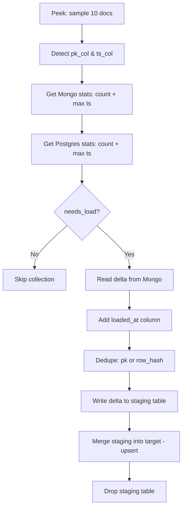
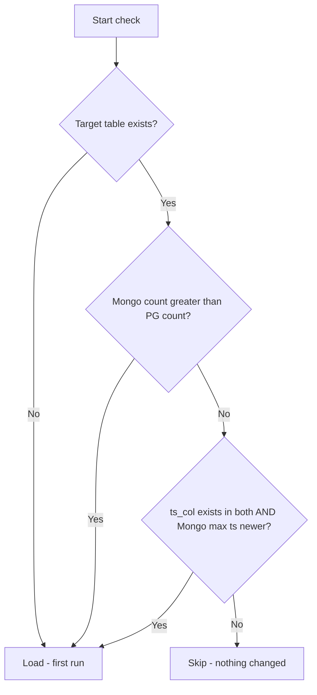
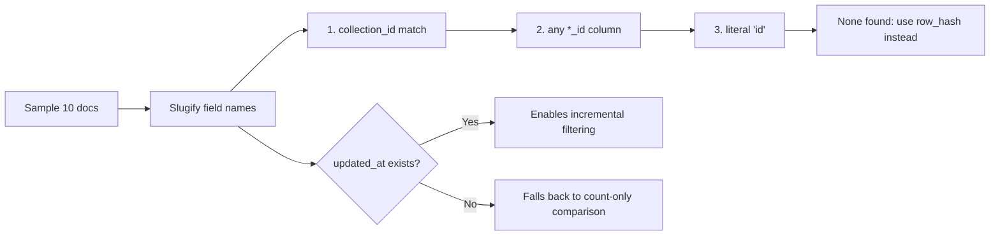

# Incremental Loading: Mongo → Postgres ETL

## Core idea
No external state files or checkpoints. **Postgres itself is the watermark.** Every run compares Mongo to Postgres directly:
1. Document count (Mongo) vs row count (Postgres)
2. Max value of a timestamp column (default `updated_at`) in Mongo vs Postgres

If both match, the collection is skipped. If not, only the newer rows are pulled.

## Step-by-step flow

## The needs_load decision

If none of these are true, the collection is skipped entirely — no Spark read, no JDBC write. Full refresh mode bypasses this check completely.

## Primary key & timestamp detection

## Reading the delta
- **Incremental + ts_col exists + PG has a max ts** → Mongo query filters to `ts_col > pg_max_ts` (filtering happens at the source).
- **Full refresh, or no ts_col, or first run** → entire collection is read.
- No matching documents → collection marked skipped.

Nulls/NaN are preserved as real SQL nulls, never the string "None".

## Dedup & merge logic

| Has primary key | No primary key |
|---|---|
| Drop duplicate rows sharing a pk | Compute `_row_hash` = MD5 of all data columns |
| Unique constraint on pk | Unique constraint on `_row_hash` |
| `ON CONFLICT (pk) DO UPDATE` — true upsert | `ON CONFLICT (row_hash) DO NOTHING` — dedupe only, no updates |

Schema evolution runs automatically: new Mongo fields not yet in Postgres get added via `ALTER TABLE ADD COLUMN` (typed TEXT).

## Full refresh mode
- `needs_load` check is skipped — every targeted collection is processed regardless of change.
- Mongo read pulls the entire collection.
- If the target table exists, it's truncated (identity reset) before merging.
- Table creation / schema evolution still run the same way.

## Edge cases
- **No timestamp column**: decision relies on count comparison only; every load pulls the full collection (no filter to apply).
- **No primary key**: `_row_hash` stands in as the unique key; re-running the same window silently skips duplicates instead of updating them.

## Run summary & failures
After all collections process, a summary logs per collection: loaded/skipped, Mongo count, new delta rows, rows merged, rows failed. Failed collections still get their staging table cleaned up. The script exits non-zero if **any** collection had failures, but every other collection still gets processed.