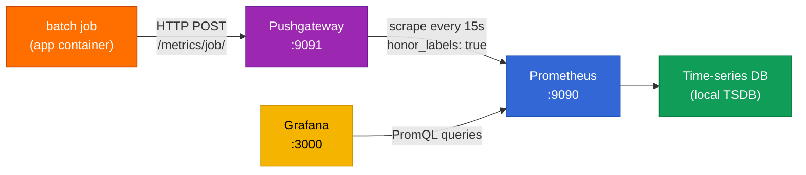

# Monitoring & Observability

Every pipeline run publishes metrics to a Pushgateway → Prometheus → Grafana stack. This document explains the flow, the metrics, and how to query them.

---

## Metric Pipeline



The `honor_labels: true` setting in `docker/prometheus.yml` is **critical** — it preserves the `job` and `instance` labels set by the Pushgateway instead of overwriting them with the scrape target, so multiple runs of the same job don't get collapsed into one series.

---

## Pushgateway Design

The Pushgateway is the right choice here because:

- The pipeline is **batch**, not long-running — there are no Prometheus scrape targets
- Each run is a **discrete event** with start/end timestamps
- Metrics are **pushed atomically** at the end of the run, so Prometheus never sees a partial state

`utils/metrics.py` wraps the Pushgateway HTTP API:

```python
pushgateway_url = f"http://{pushgateway_host}:9091"
job_name = "bike_store_pipeline"
push_to_gateway(pushgateway_url, job=job_name, registry=registry)
```

---

## Metrics Emitted

| Metric | Type | Labels | Source |
|---|---|---|---|
| `etl_run_failed` | Gauge | `job` (etl, plpgsql, gx) | any failed stage |
| `etl_run_duration_seconds` | Gauge | `job` | wall-clock time of the stage |
| `etl_rows_loaded` | Gauge | `collection` | rows written to Postgres |
| `etl_rows_failed` | Gauge | `collection` | staging/merge rejections |
| `plpgsql_tests_failed` | Gauge | `file` | per-file DQ failures |
| `gx_expectations_failed` | Gauge | `table` | per-table GX failures |
| `batch_job_last_run_timestamp` | Gauge | `job` | Unix timestamp of last successful run |

---

## Prometheus Configuration: `docker/prometheus.yml`

```yaml
global:
  scrape_interval: 15s
  evaluation_interval: 15s

scrape_configs:
  - job_name: pushgateway
    honor_labels: true        # critical: preserves job label
    static_configs:
      - targets: ['pushgateway:9091']
```

---

## Grafana

Grafana is fully provisioned — datasources and dashboards are auto-loaded from `docker/grafana/provisioning/` on container start.

### Provisioned on startup

| Path | Purpose |
|---|---|
| `datasources/datasource.yml` | Prometheus datasource (default, auto-selected) |
| `dashboards/dashboards.yml` | Tells Grafana to load JSON dashboards from `/etc/grafana/provisioning/dashboards/files` |
| `dashboards/files/pipeline_overview.json` | 8-panel pipeline dashboard |

### Dashboard: Pipeline Overview

8 panels, designed for a single-page at-a-glance health view:

| Panel | Type | Metric |
|---|---|---|
| ETL Run Failed | Stat | `etl_run_failed` |
| PL/pgSQL Failed | Stat | `plpgsql_tests_failed` |
| GX Failed | Stat | `gx_expectations_failed` |
| ETL Duration | Time series | `etl_run_duration_seconds{job="etl"}` |
| ETL Rows Loaded | Time series | `etl_rows_loaded` |
| ETL Rows Failed | Time series | `etl_rows_failed` |
| DQ Test Pass Rate | Gauge | derived from total - failed |
| Batch Job Last Run Timestamps | Stat | `batch_job_last_run_timestamp` |

---

## Querying Prometheus directly

Open http://localhost:9090/graph and try these:

```promql
# Last ETL run timestamp
batch_job_last_run_timestamp{job="etl"}

# Average ETL duration over last 24h
avg_over_time(etl_run_duration_seconds{job="etl"}[24h])

# Collections with most load failures in last 24h
topk(5, etl_rows_failed)

# Pipeline pass/fail over last 7 days
sum_over_time(etl_run_failed[7d])
```

---

## Resetting Prometheus Data

Prometheus stores its time-series DB inside the `prometheus_data` Docker volume. To clear it:

```bash
make down && docker volume rm bike-store-prometheus_data && make up
```

Or just `make clean` (removes all volumes), but that wipes Postgres + MongoDB too.

---

## Alerting

Grafana can be configured to send alerts based on PromQL queries (email, Slack, webhook). This stack does not include alerting rules out of the box — add them via:

1. Grafana UI → Alerting → Alert rules
2. Or provision via `docker/grafana/provisioning/alerting/`
