# Project Structure

Complete file-by-file map of the repository, with one-line descriptions for every directory and notable file.

---

## Top Level

```mermaid
flowchart TD
    classDef root fill:#e3f2fd,stroke:#1565c0,color:#0d47a1
    classDef folder fill:#fff8e1,stroke:#f9a825,color:#5d4037
    classDef config fill:#e8f5e9,stroke:#2e7d32,color:#1b5e20
    classDef hidden fill:#fce4ec,stroke:#c2185b,color:#880e4f

    ROOT[("bike-store-relational-database/")]:::root

    ROOT --> A["docker/"]:::folder
    ROOT --> B["docs/"]:::folder
    ROOT --> C["gx/"]:::folder
    ROOT --> D["jars/"]:::folder
    ROOT --> E["logs/"]:::folder
    ROOT --> G["scripts/"]:::folder
    ROOT --> H["sql/"]:::folder
    ROOT --> I["src/"]:::folder
    ROOT --> J["tests/"]:::folder

    ROOT --> K["docker-compose.yml"]:::config
    ROOT --> L["Makefile"]:::config
    ROOT --> M["pyproject.toml"]:::config
    ROOT --> N["uv.lock"]:::config
    ROOT --> O["README.md"]:::config
    ROOT --> P[".env.example"]:::hidden
    ROOT --> Q[".dockerignore"]:::hidden
    ROOT --> R[".gitignore"]:::hidden
```



---

## Directory: `docker/`

Container build assets.

| File | Purpose |
|---|---|
| `Dockerfile` | Application image (python:3.13-slim + Java JRE + uv + project source) |
| `entrypoint.sh` | Dispatches `docker compose run app <cmd>` to the right script |
| `prometheus.yml` | Prometheus scrape config (target: pushgateway) |
| `grafana/provisioning/datasources/datasource.yml` | Auto-load Prometheus datasource on Grafana start |
| `grafana/provisioning/dashboards/dashboards.yml` | Tells Grafana to load dashboards from `files/` |
| `grafana/provisioning/dashboards/files/pipeline_overview.json` | 8-panel pipeline dashboard |

---

## Directory: `docs/`

Markdown documentation rendered on GitHub.

| File | Purpose |
|---|---|
| `ARCHITECTURE.md` | Visual system overview + container topology + ER diagram |
| `run_book.md` | How to run, configure, troubleshoot |
| `data_catalog.md` | Full schema reference (all 9 tables, every column) |
| `incremental_loading.md` | How the ETL's incremental logic works, step by step |
| `testing.md` | Data quality strategy + both test layers |
| `docker.md` | Docker setup, image build, compose services |
| `monitoring.md` | Prometheus + Pushgateway + Grafana observability |
| `project_structure.md` | This file |
| `SQL.md` | SQL analytics library overview |
| `scripts.md` | All scripts documented with run modes + diagrams |
| `utils.md` | Utility modules reference |
| `tests.md` | Test suite overview |

---

## Directory: `gx/`

Great Expectations configuration and suites.

```
gx/
├── great_expectations.yml          — root GX config
├── expectations/
│   ├── brands.json
│   ├── categories.json
│   ├── customers.json
│   ├── orders.json
│   ├── order_items.json
│   ├── products.json
│   ├── staffs.json
│   ├── stocks.json
│   └── stores.json                 — 9 suite files, one per table
├── checkpoints/
│   └── *.yml                       — named checkpoint configs
└── uncommitted/
    ├── data_docs/                  — generated HTML reports (gitignored)
    └── validations/                — JSON validation results
```

---

## Directory: `jars/`

Binary dependencies shipped with the repo.

| File | Purpose |
|---|---|
| `postgresql.jar` | PostgreSQL JDBC driver, used by PySpark's JDBC writer |

---

## Directory: `logs/`

Generated at runtime (gitignored).

```
logs/
├── extraction/                     — ETL stage logs (one per collection per run)
├── pipeline/                       — pipeline orchestration logs
└── tests/                          — PL/pgSQL + GX test logs
```

---

## Directory: `scripts/`

Standalone executable scripts, organised into three subdirectories.

```
scripts/
├── python/                         — Python entry-point scripts
│   ├── mongo_to_postgres.py        — PySpark incremental ETL
│   ├── plpgsql_loops_tests.py      — PL/pgSQL DO-block suite runner
│   ├── run_gx.py                   — Great Expectations suite runner
│   ├── inspect_schema.py           — Print Postgres schema to stdout
│   ├── check_mongo.py              — MongoDB connectivity / collection check
│   └── seed_mongo.py               — Seed MongoDB with sample data
├── shell/                          — Bash operational scripts
│   ├── docker_dev.sh               — Docker Compose lifecycle manager
│   ├── monitor_logs.sh             — Operational health check + log monitoring
│   ├── log_cleanup.sh              — Age/size-based log cleanup
│   ├── health_check.sh             — Liveness probe for Postgres and MongoDB
│   ├── init_db.sh                  — Database initialisation helper
│   ├── backup_postgres.sh          — Postgres backup
│   ├── restore_postgres.sh         — Postgres restore
│   ├── backup_mongo.sh             — MongoDB backup
│   └── restore_mongo.sh            — MongoDB restore
└── ps1/                            — PowerShell automation (Windows)
    └── local_runner.ps1            — End-to-end pipeline runner (ETL + PL/pgSQL + GX)
```

---

## Directory: `sql/`

21 analytical SQL scripts organized by purpose (see [SQL.md](SQL.md)).

```
sql/                                — all scripts live directly here (flat layout)
├── 01_database_exploration.sql
├── 02_dimensions_exploration.sql
├── 03_date_range_exploration.sql
├── 04_measures_exploration.sql
├── 05_magnitude_analysis.sql
├── 06_ranking_analysis.sql
├── 07_change_over_time_analysis.sql
├── 08_cumulative_analysis.sql
├── 09_performance_analysis.sql
├── 10_data_segmentation.sql
├── 11_part_to_whole_analysis.sql
├── 12_customer_report.sql
├── 13_product_report.sql
├── 14_brand_report.sql
├── 15_fn_store_performance.sql
├── 16_sales_report.sql
├── 17_new_ve_return.sql
├── 18_status_check.sql
├── 19_cohort_analysis.sql
├── 20_fn_inventory_summary.sql
└── 21_fn_staff_performance.sql
```

---

## Directory: `src/`

Reusable Python modules (importable, not meant to be run directly).

### `src/pipeline/`

Core ETL logic.

| File | Purpose |
|---|---|
| `config.py` | Env-driven configuration singleton |
| `spark_session.py` | PySpark session builder with JDBC jar on driver classpath |
| `mongo_source.py` | `read_mongo_incremental()` — pulls delta from MongoDB |
| `transform.py` | Schema inference, PK/TS detection, column slugification |
| `decision.py` | `needs_load()` — the skip/load decision |
| `runner.py` | Orchestrates a single collection's load |

### `src/database/`

Postgres write-side concerns.

| File | Purpose |
|---|---|
| `schema.py` | `ensure_target_table()` — DDL, schema evolution |
| `staging.py` | `merge_staging_to_target()` — upsert or dedup |
| `jdbc_writer.py` | `write_to_staging()` — JDBC overwrite of staging table |
| `stats.py` | `pg_count_and_max_ts()` — read-side stats for decision |

### `src/validation/`

Validation layer wrappers.

| File | Purpose |
|---|---|
| `plpgsql_loops.py` | Thin wrapper around `scripts/python/plpgsql_loops_tests.py` (re-exported) |

### `utils/`

Shared connection / engine / logger / metrics.

| File | Purpose |
|---|---|
| `connection.py` | Env-driven Postgres + Mongo connection helpers |
| `engine.py` | SQLAlchemy engine factory |
| `logger.py` | File + console logger with rotation |
| `metrics.py` | Pushgateway client |

---

## Directory: `tests/`

### `tests/generic/loops/`

10 PL/pgSQL DO-block test files, one per domain:

```
01_test_brands.sql
02_test_categories.sql
03_test_customers.sql
04_test_order_items.sql
05_test_orders.sql
06_test_orphan_and_business_rules.sql
07_test_products.sql
08_test_staffs.sql
09_test_stocks.sql
10_test_stores.sql
```

### `tests/data_quality/`

Python Great Expectations runner:

| File | Purpose |
|---|---|
| `context.py` | Build a GX context from `gx/` config |
| `run.py` | Execute all 9 suites, write JSON report, push metrics |

Reports are written to `tests/data_quality/reports/validation_report_<timestamp>.json`.

---

## Top-level config files

| File | Purpose |
|---|---|
| `docker-compose.yml` | Full stack — postgres, mongodb, pushgateway, prometheus, grafana, app |
| `Makefile` | One-command pipeline automation (`make pipeline`, `make etl`, etc.) |
| `pyproject.toml` | `uv` dependency manifest, requires-python >= 3.13 |
| `uv.lock` | Locked dependency versions |
| `README.md` | Project entry point on GitHub |
| `.env.example` | Environment variable template (copy to `.env`) |
| `.dockerignore` | Build context exclusions |
| `.gitignore` | Local-only file exclusions |
