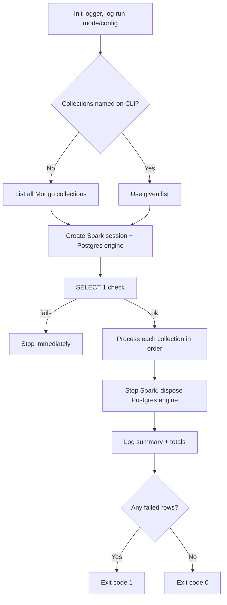

# Run Book: Mongo → Postgres ETL

## Prerequisites checklist
- `utils/connection.py`, `engine.py`, `logger.py` findable within 8 parent directories of the script
- `driver/postgresql.jar` present (or `JDBC_JAR_PATH` set)
- `pandas`, `pymongo`, `pyspark`, `sqlalchemy` installed
- `MONGO_URI`, `MONGO_DB`, `POSTGRES_HOST/PORT/DATABASE/USERNAME/PASSWORD` set in `utils/connection.py`
- `SELECT 1` succeeds against Postgres at startup

## Environment variables

| Variable | Default | Purpose |
|---|---|---|
| `ETL_SCHEMA` | `public` | Target schema for all tables |
| `ETL_TS_COL` | `updated_at` | Timestamp column for incremental comparison |
| `ETL_PK_SUFFIX` | `_id` | Suffix used to detect primary key columns |
| `JDBC_JAR_PATH` | `driver/postgresql.jar` | Postgres JDBC driver location |
| `PYSPARK_PYTHON` / `PYSPARK_DRIVER_PYTHON` | system python | Interpreter Spark workers/driver use |

## How to run

| Command | What it does |
|---|---|
| `python -m scripts.mongo_to_postgres` | Incremental, all collections (normal scheduled run) |
| `python -m scripts.mongo_to_postgres --collection staffs --collection orders` | Incremental, only named collections |
| `python -m scripts.mongo_to_postgres --full-refresh` | Full reload, all collections (truncate + reload) |
| `python -m scripts.mongo_to_postgres --collection staffs --full-refresh` | Full reload, one collection only |

`--full-load` works as a synonym for `--full-refresh`.

## What happens during a run

## Key functions at a glance

| Function | Responsibility |
|---|---|
| `_find_project_root()` | Walks up to 8 dirs to locate `utils/connection.py` |
| `_slugify(s)` | Normalizes field/collection names into safe Postgres identifiers |
| `detect_pk_col` / `detect_ts_col` | Heuristic column detection from a sample |
| `_mongo_collection_stats` | Mongo count + max timestamp via PyMongo |
| `get_postgres_stats` | Postgres table existence, row count, max timestamp |
| `needs_load` | Core skip/load decision |
| `read_mongo_incremental` | Pulls delta (or full collection) from Mongo |
| `ensure_schema` / `ensure_target_table` | Creates schema/table, adds unique constraint, evolves schema |
| `merge_staging_to_target` | Upsert or dedupe-only merge from staging to target |
| `drop_staging` / `truncate_table` | Cleanup and full-refresh reset |
| `process_collection` | Runs the full pipeline for one collection |
| `main` | Top-level orchestration, discovery, summary, exit code |

## Troubleshooting

| Symptom | Fix |
|---|---|
| `FileNotFoundError: postgresql.jar` | Add jar at `driver/postgresql.jar` or set `JDBC_JAR_PATH` |
| `RuntimeError`: project root not found | Run as `python -m scripts.mongo_to_postgres` from inside the project tree |
| Fails at Postgres connectivity check | Verify `POSTGRES_HOST/PORT/DATABASE/USERNAME/PASSWORD` |
| Collection always skipped despite changes | Confirm `updated_at` is actually updated on writes; watch the same-timestamp edge case, then run a targeted `--collection name --full-refresh` |
| Staging/merge failure | Check the summary's failed-row count — usually a constraint or Postgres permissions issue; staging is auto-cleaned, safe to re-run |
| `order_items` (composite key) behaves oddly | Only a single-column pk gets detected, which is wrong for this table; exclude from automated runs until a dedicated handling path is built |

## Common tasks
- **Add a new Mongo field**: nothing to do — `ensure_target_table` auto-adds it as TEXT on the next run.
- **Full backfill or recovery**: `python -m scripts.mongo_to_postgres --full-refresh`