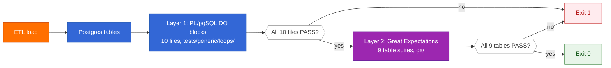
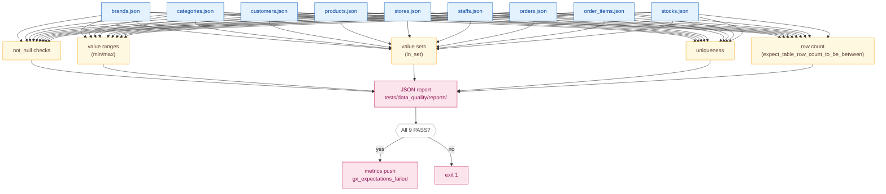

# Testing & Data Quality

Every Postgres load is verified by **two complementary test layers**. This page explains what each layer catches, where it lives, and how to run it.

---

## Two Layers, One Invariant



**Invariant**: every CI run must end with both layers green or the pipeline blocks.

---

## Layer 1: PL/pgSQL DO-Block Suite

10 numbered `.sql` files in `tests/generic/loops/`, each containing multiple `DO $$ ... $$;` anonymous blocks. The Python wrapper `scripts/plpgsql_loops_tests.py` splits each file on `-- Test N:`, `-- Orphan N:`, `-- Business N:` markers, executes each block, and reports the result.

```mermaid
flowchart TD
    classDef file fill:#e3f2fd,stroke:#1565c0,color:#0d47a1
    classDef check fill:#fff8e1,stroke:#f9a825,color:#5d4037
    classDef cat fill:#fce4ec,stroke:#c2185b,color:#880e4f

    A["01_unique_constraint_checks.sql"]:::file
    B["02_basic_aggregation_sanity.sql"]:::file
    C["03_null_check_columns.sql"]:::file
    D["04_type_validation.sql"]:::file
    E["05_referential_integrity.sql"]:::file
    F["06_orphan_check_tables.sql"]:::file
    G["07_business_logic_validations.sql"]:::file
    H["08_advanced_logic.sql"]:::file
    I["09_id_check.sql"]:::file
    J["10_date_check.sql"]:::file

    K["Uniqueness<br/>(01, 09)"]:::cat
    L["Integrity<br/>(05, 06)"]:::cat
    M["Sanity<br/>(02, 08)"]:::cat
    N["Data quality<br/>(03, 04)"]:::cat
    O["Business rules<br/>(07)"]:::cat
    P["Date integrity<br/>(10)"]:::cat

    A --> K
    B --> M
    C --> N
    D --> N
    E --> L
    F --> L
    G --> O
    H --> M
    I --> K
    J --> P
```



### What each file covers

| File | Category | What it catches |
|---|---|---|
| `01_unique_constraint_checks.sql` | Uniqueness | Duplicate primary keys, non-unique natural keys |
| `02_basic_aggregation_sanity.sql` | Sanity | Implausible aggregates (negative counts, zero rows in expected tables) |
| `03_null_check_columns.sql` | Data quality | NULL values in NOT-NULL-equivalent columns |
| `04_type_validation.sql` | Data quality | String values where numerics expected, malformed dates |
| `05_referential_integrity.sql` | Integrity | FK violations, missing parents |
| `06_orphan_check_tables.sql` | Integrity | Orphan rows in junction tables (`order_items`, `stocks`) |
| `07_business_logic_validations.sql` | Business rules | Discount > 100%, list_price <= 0, order_date in future |
| `08_advanced_logic.sql` | Sanity | Cross-table consistency (e.g. order total = sum of items) |
| `09_id_check.sql` | Uniqueness | Negative or zero IDs |
| `10_date_check.sql` | Date integrity | Dates in impossible ranges, ordering violations |

### Why DO blocks, not plain queries?

`DO $$ ... $$;` anonymous blocks support **PL/pgSQL control flow** (loops, conditional RAISE) which plain `SELECT` queries don't. They also let the test author use `ASSERT` and `RAISE EXCEPTION` for explicit failure semantics.

### Running it

```bash
make dq-loops
uv run python scripts/plpgsql_loops_tests.py
uv run python scripts/plpgsql_loops_tests.py --show-failures --max-rows 5
```

---

## Layer 2: Great Expectations

9 expectation suites, one per table, defined as JSON in `gx/expectations/`. The runner `scripts/run_gx.py` connects to Postgres, executes each suite against its table, and writes a JSON report to `tests/data_quality/reports/`.



### What GX catches that PL/pgSQL doesn't

- **Statistical distributions** — value ranges, quantile checks
- **Value set membership** — `order_status IN ('Pending','Processing','Shipped','Delivered','Canceled')`
- **Schema validation** — `expect_column_to_exist`, `expect_column_values_to_be_of_type`
- **Row count expectations** — `expect_table_row_count_to_be_between`

### Running it

```bash
make dq-gx                                  # all 9 tables
make dq-gx ARGS="orders products"           # specific tables
uv run python scripts/run_gx.py
```

Reports land in `tests/data_quality/reports/validation_report_<timestamp>.json`. The `monitor_logs.sh` script reads the latest report to set a `[FAIL]` line in its summary.

---

## Adding a New Test

### New PL/pgSQL test

1. Create `tests/generic/loops/11_<name>.sql`
2. Start each block with `-- Test N: <description>` (or `-- Orphan N:`, `-- Business N:`)
3. Use `ASSERT` / `RAISE EXCEPTION` for explicit failure
4. The runner auto-discovers any new file

### New GX expectation

1. Add or edit `gx/expectations/<table>.json`
2. Use any [built-in expectation](https://greatexpectations.io/expectations/) — `expect_column_values_to_not_be_null`, `expect_column_values_to_be_between`, etc.
3. The runner picks it up on the next run

---

## CI Integration

Both layers are designed to be wired into a CI pipeline:

```yaml
- name: ETL + data quality
  run: make pipeline
```

`make pipeline` runs ETL → PL/pgSQL → GX in sequence. Any failure exits non-zero and fails the CI job.
