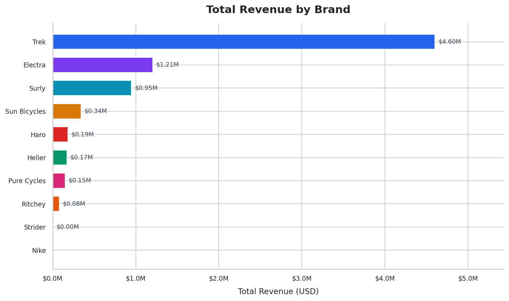
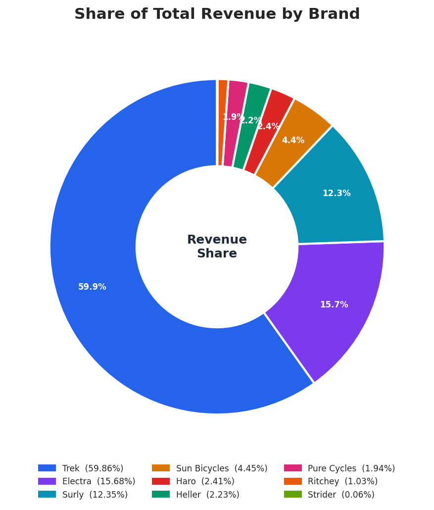
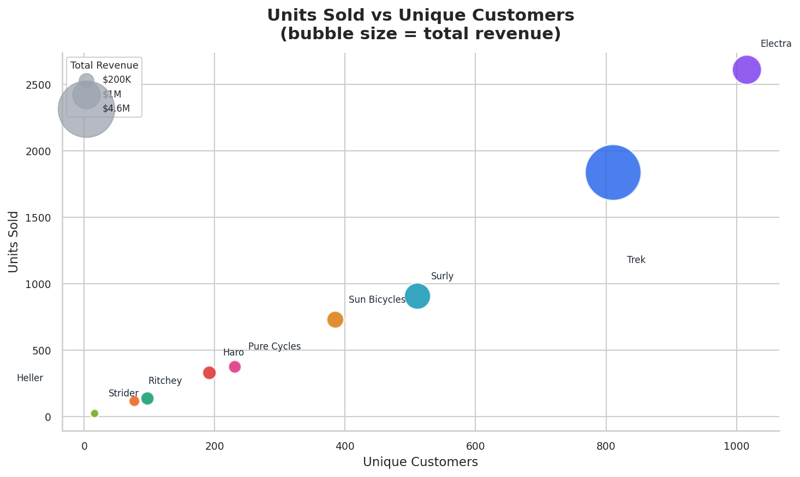
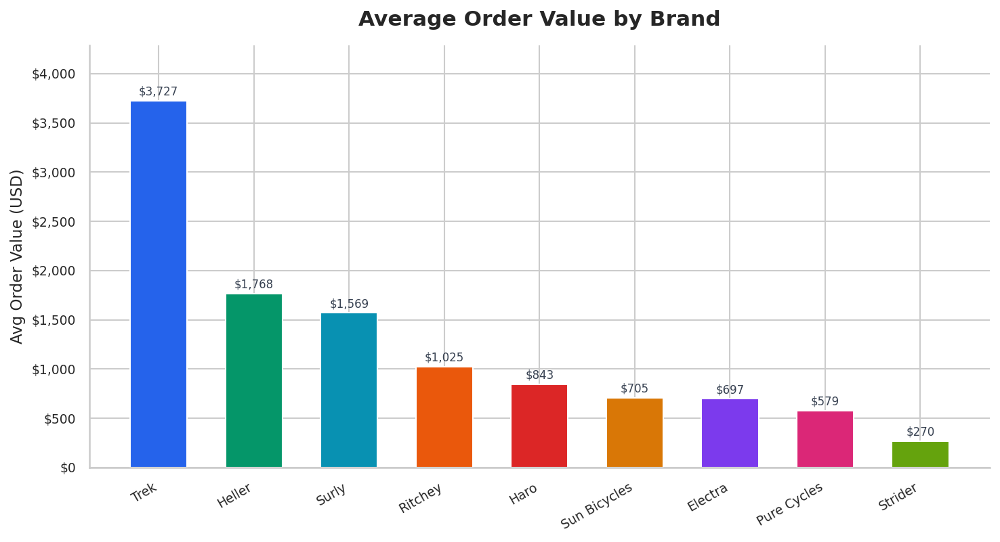
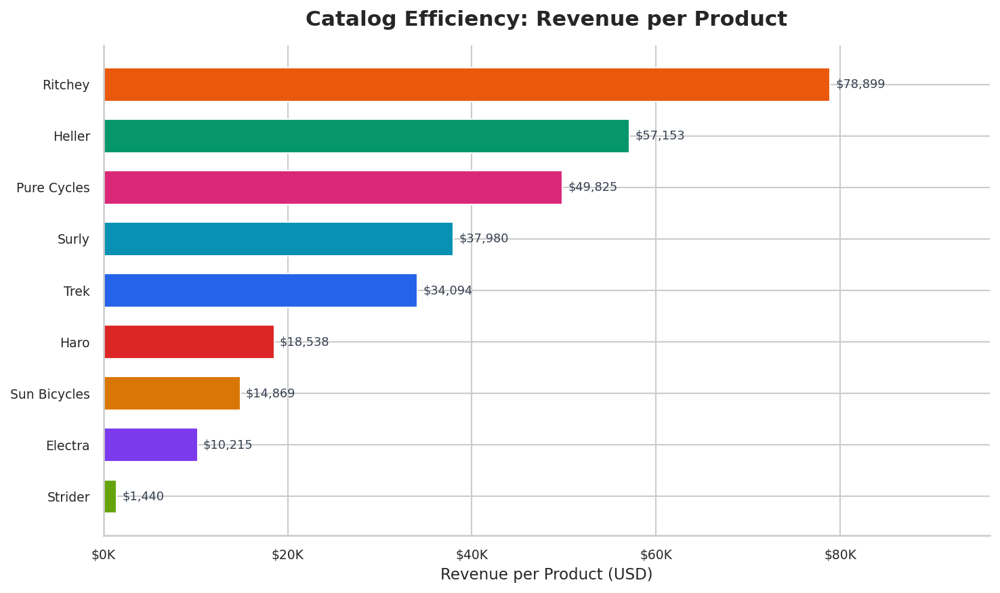
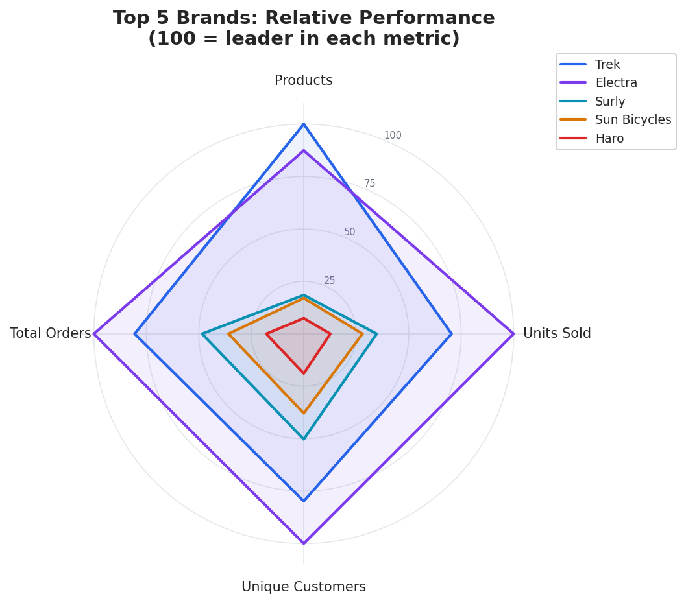

# Brand Performance Report

## Overview

This report analyzes brand level sales performance using the query in 14_brand_report.sql. The query joins brands to products, order_items, and orders to compute, for each brand, the number of products carried, units sold, unique customers, total orders, total revenue, average order value, and that brand's percentage share of total revenue across the whole business. Brands are ranked by total revenue.

All charts in this report were generated with seaborn and matplotlib from the query output.

## How the Numbers Are Calculated

The query starts from the brands table and left joins outward to products, order_items, and orders. This left join chain is important: it guarantees every brand appears in the output even if it has no products or no sales, which is why Nike appears with all zero values.

For each brand, the query computes:

- total_products: count of distinct products belonging to the brand
- total_orders: count of distinct orders that contain at least one of the brand's products
- unique_customers: count of distinct customers who have ordered at least one of the brand's products
- total_revenue: sum of total_value across all order_items for the brand's products, rounded to 2 decimals
- avg_order_value: average total_value per order_item row for the brand, rounded to 2 decimals
- units_sold: sum of quantity across all order_items for the brand's products

A second CTE (Grand_revenue) sums total_revenue across all brands to get a single grand total, which is then used to compute pct_of_total, each brand's share of overall revenue. The final SELECT ranks brands by total_revenue using RANK(), so ties would receive the same rank.

## Result Summary

| rank | brand | products | units sold | unique customers | orders | total revenue | avg order value | pct of total |
|---|---|---|---|---|---|---|---|---|
| 1 | Trek | 135 | 1839 | 811 | 883 | $4,602,752.41 | $3,726.93 | 59.86% |
| 2 | Electra | 118 | 2612 | 1016 | 1096 | $1,205,318.10 | $697.12 | 15.68% |
| 3 | Surly | 25 | 908 | 511 | 531 | $949,506.31 | $1,569.43 | 12.35% |
| 4 | Sun Bicycles | 23 | 731 | 385 | 393 | $341,994.16 | $705.14 | 4.45% |
| 5 | Haro | 10 | 331 | 192 | 196 | $185,384.19 | $842.66 | 2.41% |
| 6 | Heller | 3 | 138 | 97 | 97 | $171,458.93 | $1,767.62 | 2.23% |
| 7 | Pure Cycles | 3 | 376 | 231 | 232 | $149,476.34 | $579.37 | 1.94% |
| 8 | Ritchey | 1 | 118 | 77 | 77 | $78,898.82 | $1,024.66 | 1.03% |
| 9 | Strider | 3 | 25 | 16 | 16 | $4,320.45 | $270.03 | 0.06% |
| 10 | Nike | 0 | 0 | 0 | 0 | $0.00 | $0.00 | 0.00% |

## Revenue Distribution Across Brands

Trek dominates total revenue at over 4.6 million dollars, nearly four times the combined revenue of every other brand. Electra and Surly form a clear second tier in the high hundred thousands to low millions, while the remaining seven brands together contribute less than 6 percent of total revenue.

The donut chart makes the concentration explicit: Trek alone accounts for 59.86 percent of all revenue. Trek, Electra, and Surly combined account for nearly 88 percent of total revenue, meaning the remaining seven brands split the last 12 percent. Strider's 0.06 percent share is effectively negligible, and Nike contributes nothing.

## Sales Volume vs Customer Reach

This chart plots units sold against unique customers, with bubble size representing total revenue. Two distinct patterns emerge.

Electra sits furthest right and highest, selling the most units (2612) to the most unique customers (1016), but its bubble is noticeably smaller than Trek's despite higher volume. Trek, in contrast, sells fewer units (1839) to fewer customers (811) but its bubble is by far the largest, since each unit carries a much higher price.

The brands cluster along a roughly linear relationship between units sold and unique customers, which suggests that most customers across most brands buy a small number of units per order (close to one to one), except where this ratio breaks down.

## Price Positioning: Average Order Value

This chart reveals the price tier each brand operates in, independent of total volume.

Trek's average order value of $3,726.93 is more than double the next highest brand (Heller at $1,767.62), confirming Trek's revenue dominance comes from premium pricing as much as from volume. Heller and Surly occupy a middle premium tier (roughly $1,500 to $1,800), while Ritchey, Haro, Sun Bicycles, and Electra cluster in a more accessible $580 to $1,025 range. Pure Cycles and Strider sit at the lower end, under $600.

Notably, Electra, the volume leader, has one of the lowest average order values among brands with actual sales, reinforcing that its strategy is high volume at accessible price points, the opposite of Trek's.

## Catalog Efficiency: Revenue per Product

This metric (total revenue divided by number of products in the catalog) highlights which brands generate the most revenue per catalog item, regardless of how large their catalog is.

Ritchey stands out here despite having only a single product, that one product generates $78,899 in revenue, the highest revenue per product of any brand. Heller and Pure Cycles, also small catalogs (3 products each), follow with $57,153 and $49,825 per product respectively.

By contrast, Trek and Electra, the two largest catalogs (135 and 118 products), generate far less per product ($34,094 and $10,215), since their revenue is spread across many SKUs. This suggests Trek's overall revenue lead comes from having many products that each sell reasonably well, while brands like Ritchey, Heller, and Pure Cycles succeed with a small number of highly productive products.

Strider has both a small catalog and the lowest revenue per product ($1,440), making it the weakest performer on this metric among brands with any sales at all.

## Top 5 Brands: Relative Performance

This chart normalizes four metrics (products, units sold, unique customers, total orders) to a 0 to 100 scale within the top 5 brands, where 100 represents whichever brand leads that specific metric. This allows comparison of shape rather than absolute scale.

Trek leads on product count (100) but trails Electra on units sold, unique customers, and total orders (70, 80, and 80 percent of Electra's values respectively). Electra leads on three of the four operational metrics but has a smaller catalog than Trek (88 percent of Trek's product count).

Surly and Sun Bicycles show a similar shape to each other: low product count relative to their other metrics, meaning each of their products is doing comparatively more work in terms of orders and customers reached. Haro trails all four metrics relative to the top 4, consistent with its position as the smallest of the top 5 brands by revenue.

## Key Findings

Revenue is heavily concentrated: a single brand, Trek, accounts for roughly 60 percent of total revenue, and the top 3 brands account for nearly 88 percent. The remaining 7 brands operate in a long tail.

Trek's lead is driven by price, not just volume: Trek's average order value is more than double any other brand, and its revenue per product, while solid, is not the highest, meaning Trek's dominance comes primarily from being a premium brand with a wide catalog, not from any single blockbuster product.

Electra is the volume and reach leader: highest units sold, highest unique customers, highest total orders, but at a lower price point, making it the most broadly adopted brand even though it ranks second in revenue.

Small catalogs can be highly efficient: Ritchey, Heller, and Pure Cycles, all with 3 or fewer products, post some of the highest revenue per product figures in the dataset, suggesting these brands carry a small number of strong performing items.

Nike is a non performing brand: zero products, zero orders, zero revenue. This brand exists in the brands table but has no corresponding products, meaning either no products have been catalogued for it yet, or it should be reviewed for removal or reassessment as a stocked brand.

Strider is the weakest active brand: lowest revenue ($4,320.45), lowest average order value ($270.03), and lowest revenue per product ($1,440) among brands with any sales, making it a candidate for review, whether that means promotional support, repositioning, or discontinuation.

## Notes on Data Quality Relevance

This report depends on the integrity of the relationships between brands, products, order_items, and orders. The orphan and business rule checks described in data quality checks.md are directly relevant here: an orphaned order_item (one whose product_id does not exist in products) would silently be excluded from this report's totals due to the inner-join-like effect of the join chain after the initial left joins, potentially understating a brand's true revenue. Similarly, the business check for order_item price mismatches (order_item list_price far from the product's current list_price) could indicate that historical order data does not reflect current product pricing, which would affect interpretation of the average order value figures above if prices have changed significantly over time.