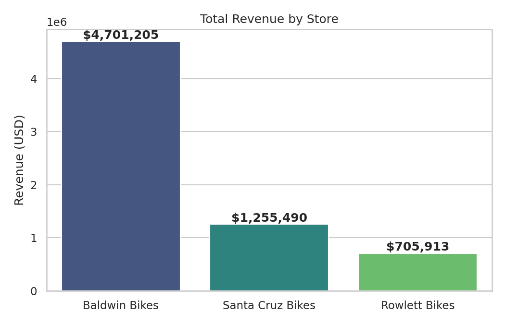
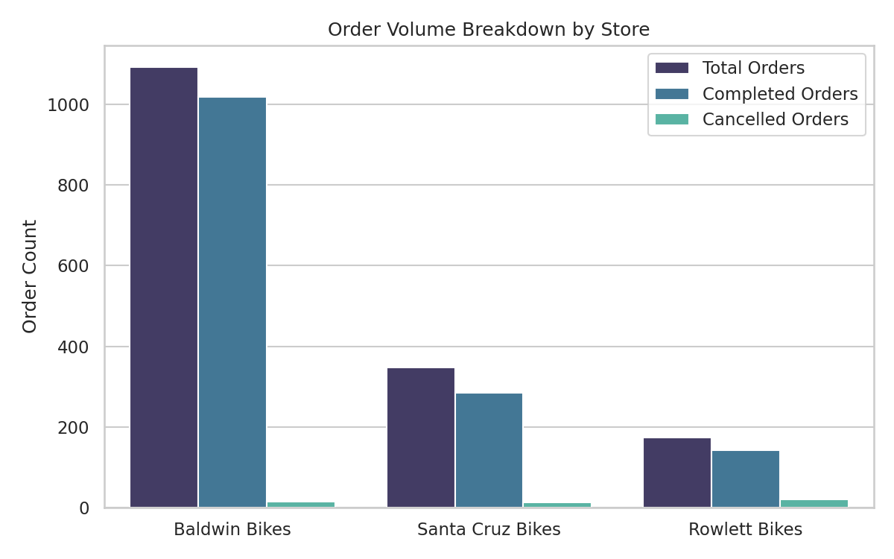
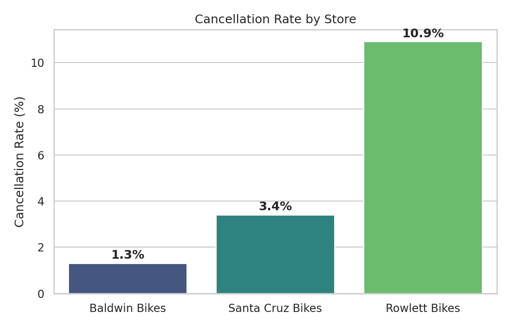
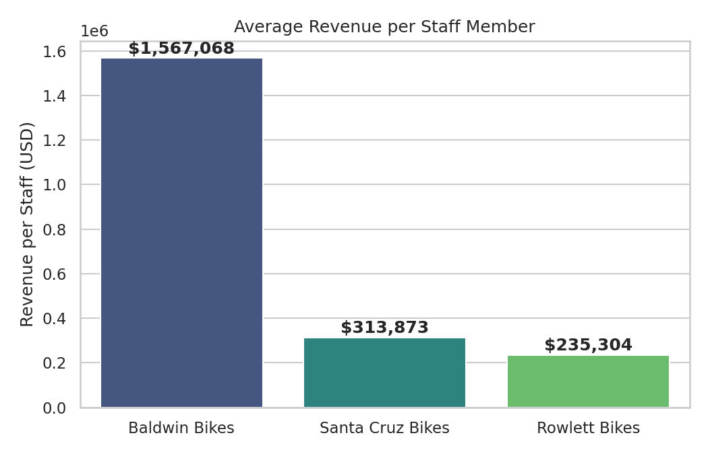
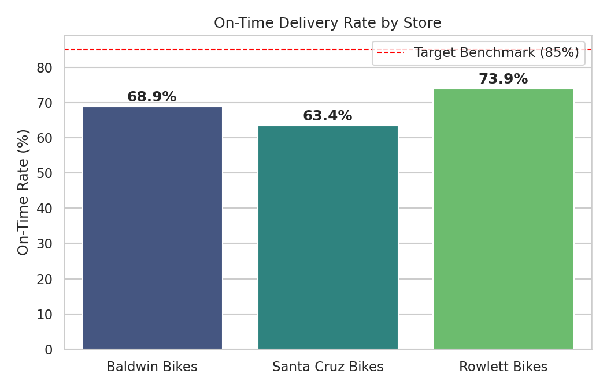
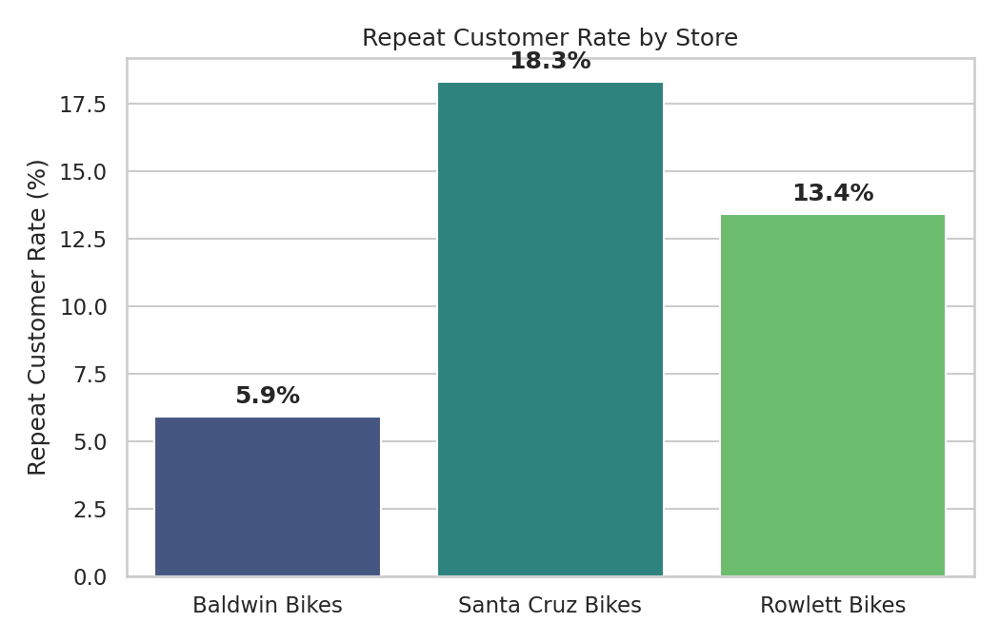
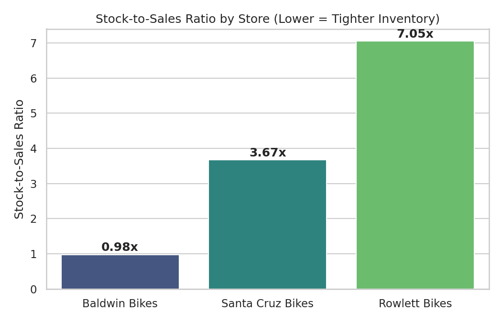

# Store Performance Report

**Reporting Period:** 2016-01-01 to 2018-12-28
**Source:** fn_store_performance()
**Stores Analyzed:** 3 (Baldwin Bikes, Santa Cruz Bikes, Rowlett Bikes)

---

## 1. Executive Summary

Baldwin Bikes is the dominant performer across nearly every dimension, generating roughly 70% of total revenue across all three stores despite having far fewer staff per dollar of revenue generated. Santa Cruz Bikes is the second-largest contributor but operates with the lowest revenue efficiency per staff member. Rowlett Bikes is the smallest store by volume and revenue, but it carries the highest cancellation rate and the best on-time delivery performance, indicating a mixed operational profile.

---

## 2. Store Comparison Table

| Metric | Baldwin Bikes | Santa Cruz Bikes | Rowlett Bikes |
|---|---|---|---|
| Location | Baldwin, NY | Santa Cruz, CA | Rowlett, TX |
| Total Orders | 1,093 | 348 | 174 |
| Completed Orders | 1,019 | 284 | 142 |
| Cancelled Orders | 14 | 12 | 19 |
| Cancellation Rate | 1.3% | 3.4% | 10.9% |
| Total Revenue | $4,701,205.27 | $1,255,490.45 | $705,913.42 |
| Avg Order Value | $4,613.55 | $4,420.74 | $4,971.22 |
| Total Units Sold | 4,427 | 1,236 | 655 |
| Total Discount Given | $316.30 | $85.67 | $43.15 |
| On-Time Rate | 68.9% | 63.4% | 73.9% |
| Total Staff | 3 | 4 | 3 |
| Avg Revenue per Staff | $1,567,068.42 | $313,872.61 | $235,304.47 |
| Total Customers | 1,019 | 284 | 142 |
| Repeat Customers | 60 | 52 | 19 |
| Total Stock Quantity | 4,359 | 4,532 | 4,620 |

---

## 3. Revenue Distribution



Total revenue across all stores: **$6,662,609.14**

Baldwin Bikes alone generates more revenue than Santa Cruz and Rowlett combined (almost 3.7x), accounting for roughly 70.6% of total revenue.

---

## 4. Order Volume Breakdown



Baldwin Bikes processes substantially more total, completed, and cancelled orders in absolute terms, but the proportion of cancelled orders relative to total volume is where Rowlett stands out (see cancellation rate below).

---

## 5. Cancellation Rate



Despite having the fewest orders, Rowlett has the highest cancellation rate by a wide margin — nearly 3.2x Santa Cruz and over 8x Baldwin.

---

## 6. Revenue Efficiency Per Staff Member



Baldwin generates roughly **5x more revenue per staff member** than Santa Cruz and nearly **6.7x more** than Rowlett, despite both having the same headcount (3) as Rowlett.

---

## 7. On-Time Delivery Rate



All three stores fall short of an 85% on-time benchmark (a typical target for healthy fulfillment operations). Santa Cruz lags furthest behind at 63.4%.

---

## 8. Customer Retention

| Store | Total Customers | Repeat Customers | Repeat Rate |
|---|---|---|---|
| Baldwin Bikes | 1,019 | 60 | 5.9% |
| Santa Cruz Bikes | 284 | 52 | 18.3% |
| Rowlett Bikes | 142 | 19 | 13.4% |



Despite Baldwin's massive order volume, its repeat customer rate is by far the lowest — suggesting a high proportion of one-time buyers and weaker long-term loyalty relative to its size.

---

## 9. Inventory Position

| Store | Total Stock Quantity | Units Sold (Period) | Stock-to-Sales Ratio |
|---|---|---|---|
| Baldwin Bikes | 4,359 | 4,427 | 0.98x |
| Santa Cruz Bikes | 4,532 | 1,236 | 3.67x |
| Rowlett Bikes | 4,620 | 655 | 7.05x |



Baldwin's inventory is nearly perfectly matched to demand (almost a 1:1 ratio), while Rowlett is holding more than 7x its period unit sales in stock — a sign of significant overstocking or understated demand at that location.

---

## 10. Key Insights

1. **Baldwin Bikes is the revenue and efficiency leader** — it produces over 70% of total revenue and over 5x the revenue per staff member of either other store, with the same or fewer staff.

2. **Rowlett Bikes has a cancellation problem** — a 10.9% cancellation rate is more than triple the average of the other two stores. This is the single largest operational red flag in the dataset.

3. **Santa Cruz Bikes is understaffed relative to output, or overstaffed relative to revenue** — with 4 staff producing the lowest revenue-per-staff figure ($313,873), it is the least efficient store on a per-head basis, and also has the worst on-time rate (63.4%).

4. **Baldwin's customer loyalty is disproportionately low** — only 5.9% of its customers are repeat buyers, versus 18.3% at Santa Cruz. Given Baldwin's order volume, even a modest improvement in retention could yield outsized revenue gains.

5. **Inventory imbalance across stores** — Rowlett is sitting on roughly 7x its period sales volume in stock, while Baldwin's inventory almost exactly matches its sales. This points to a potential redistribution opportunity.

6. **No store meets a strong on-time delivery benchmark** — all three are below 75%, with Santa Cruz the weakest at 63.4%. Fulfillment delays are a shared, store-wide issue, not isolated to one location.

7. **Discounting is minimal across the board** — total discounts given ($316.30, $85.67, $43.15) are negligible relative to revenue, suggesting discounting is not currently a meaningful lever being used to drive volume or retention.

---

## 11. Business Recommendations

### Priority 1 — Address Rowlett's Cancellation Rate (10.9%)
- Conduct a root-cause audit of the 19 cancelled (Rejected) orders: check for stock availability issues, payment failures, or fulfillment delays that may be triggering cancellations.
- Cross-reference cancellations against Rowlett's high stock-to-sales ratio (7.05x) — if stock is abundant but cancellations are high, the issue is likely process-related (staffing, order handling) rather than inventory-related.
- Target: bring cancellation rate down to below 5% within two reporting cycles.

### Priority 2 — Improve On-Time Fulfillment Across All Stores
- Investigate shipping/logistics workflows at Santa Cruz first (63.4% on-time), since it is both the worst performer and has 4 staff — suggesting a process issue rather than a staffing shortage.
- Standardize a fulfillment SLA (e.g., 85%+ on-time) and review required_date vs shipped_date gaps to identify bottlenecks (warehouse picking, courier delays, order processing time).

### Priority 3 — Boost Customer Retention at Baldwin Bikes
- With only 5.9% repeat customers against 1,019 total customers, even a 5-point improvement in repeat rate could translate into substantial incremental revenue given Baldwin's average order value of $4,613.55.
- Introduce loyalty incentives, post-purchase follow-up, or targeted re-engagement campaigns (email/SMS) for first-time Baldwin customers.
- Study Santa Cruz's retention practices (18.3% repeat rate) as an internal benchmark for what's driving repeat behavior there.

### Priority 4 — Rebalance Inventory
- Rowlett is overstocked relative to demand (7.05x stock-to-sales) while Baldwin runs near 1:1. Consider redistributing slow-moving stock from Rowlett to Baldwin or Santa Cruz, where demand is comparatively higher.
- Review whether Rowlett's overstock is tying up working capital that could be better allocated to high-performing locations.

### Priority 5 — Reassess Staffing Allocation at Santa Cruz
- Santa Cruz has the highest staff count (4) but the lowest revenue-per-staff ($313,873) and weakest on-time rate. Evaluate whether staff are being deployed efficiently, whether training gaps exist, or whether the store is simply underperforming on demand generation (marketing/local positioning) rather than fulfillment capacity.

### Priority 6 — Leverage Baldwin as a Best-Practice Model
- Baldwin's near-1:1 inventory ratio and high revenue-per-staff suggest efficient operational practices. Document and assess whether elements of Baldwin's inventory management or staffing model can be replicated at Santa Cruz and Rowlett.

---

## 12. Summary Scorecard

| Dimension | Best Performer | Worst Performer |
|---|---|---|
| Total Revenue | Baldwin Bikes | Rowlett Bikes |
| Revenue per Staff | Baldwin Bikes | Rowlett Bikes |
| Cancellation Rate (lower is better) | Baldwin Bikes (1.3%) | Rowlett Bikes (10.9%) |
| On-Time Rate | Rowlett Bikes (73.9%) | Santa Cruz Bikes (63.4%) |
| Repeat Customer Rate | Santa Cruz Bikes (18.3%) | Baldwin Bikes (5.9%) |
| Inventory Efficiency (stock-to-sales) | Baldwin Bikes (0.98x) | Rowlett Bikes (7.05x) |

---

## 13. Appendix: SQL Function Definition

This report is generated from the output of the PostgreSQL function `fn_store_performance()`. The function definition is reproduced below for reference.

### Purpose

Returns a comprehensive performance summary for each store, covering orders, revenue, fulfillment, staff, customers, and inventory metrics within a given date range. Every store appears in the result set, even if it has no activity in the period (zero metrics are returned via `LEFT JOIN` and `COALESCE`).

### Signature

```sql
CREATE OR REPLACE FUNCTION fn_store_performance(
    p_start_date  DATE DEFAULT '2016-01-01',
    p_end_date    DATE DEFAULT '2018-12-28'
)
RETURNS TABLE(
    store_id              BIGINT,
    store_name            TEXT,
    city                  TEXT,
    state                 TEXT,
    total_orders          BIGINT,
    completed_orders      BIGINT,
    cancelled_orders      BIGINT,
    cancellation_rate     NUMERIC,
    total_revenue         NUMERIC,
    avg_order_value       NUMERIC,
    total_units_sold      NUMERIC,
    total_discount_given  NUMERIC,
    on_time_rate          NUMERIC,
    total_staff           BIGINT,
    avg_revenue_per_staff NUMERIC,
    total_customers       BIGINT,
    repeat_customers      BIGINT,
    total_stock_quantity  NUMERIC
)
LANGUAGE plpgsql
```

### Parameters

| Parameter | Type | Default | Description |
|---|---|---|---|
| `p_start_date` | DATE | `2016-01-01` | Start of the reporting period (inclusive) |
| `p_end_date` | DATE | `2018-12-28` | End of the reporting period (inclusive) |

### Output Columns

| Column | Description |
|---|---|
| `store_id`, `store_name`, `city`, `state` | Store identity and location |
| `total_orders` | Count of all orders placed in the date range |
| `completed_orders` | Count of orders with status `'Completed'` |
| `cancelled_orders` | Count of orders with status `'Rejected'` |
| `cancellation_rate` | `cancelled_orders / total_orders * 100`, rounded to 1 decimal |
| `total_revenue` | Sum of `order_items.total_value` for completed orders |
| `avg_order_value` | Average per-order revenue across completed orders |
| `total_units_sold` | Sum of `order_items.quantity` for completed orders |
| `total_discount_given` | Sum of `order_items.discount` for completed orders |
| `on_time_rate` | % of completed orders where `shipped_date <= required_date`, among orders that have a `shipped_date` |
| `total_staff` | Count of staff assigned to the store (not date-filtered) |
| `avg_revenue_per_staff` | `total_revenue / total_staff`, rounded to 2 decimals |
| `total_customers` | Distinct customers who placed orders in the date range |
| `repeat_customers` | Distinct customers with more than 1 order in the date range |
| `total_stock_quantity` | Current total stock quantity (not date-filtered) |

### Logic Overview (CTE Pipeline)

1. **`order_summary`** — Aggregates order counts (total, completed, cancelled) per store within the date range.
2. **`order_revenue`** — Joins `orders` to `order_items` for completed orders, computing per-order revenue, units, and discount.
3. **`revenue_metrics`** — Aggregates `order_revenue` per store into total revenue, average order value, total units sold, and total discount given.
4. **`fulfillment`** — Calculates the on-time delivery rate per store, based on completed orders with a non-null `shipped_date`.
5. **`staff_metrics`** — Counts total staff per store (independent of the date range).
6. **`customer_metrics`** — Computes distinct customer counts and repeat customer counts per store, using a subquery that counts orders per customer within the date range.
7. **`stock_metrics`** — Sums current stock quantity per store (independent of the date range).
8. **Final SELECT** — Left-joins all CTEs onto the `stores` table so every store appears, applying `COALESCE` to default missing metrics to zero, and orders the result by `total_revenue DESC`.

### Important Notes

- Stock metrics reflect **current inventory**, not inventory as of the date range.
- Staff counts reflect **all assigned staff**, not staff active specifically during the date range.
- `on_time_rate` only considers orders where `shipped_date IS NOT NULL`.
- A customer is counted as a **repeat customer** if they placed more than one order within the specified date range.
- Order status values used: `'Rejected'`, `'Processing'`, `'Completed'`, `'Pending'`. Cancellation metrics are based exclusively on `'Rejected'` status.

### Example Usage

```sql
-- Full dataset (uses defaults)
SELECT * FROM fn_store_performance();

-- Custom date range
SELECT * FROM fn_store_performance('2017-01-01', '2017-12-31');

-- Single month
SELECT * FROM fn_store_performance('2018-06-01', '2018-06-30');

-- Filter by specific store
SELECT * FROM fn_store_performance()
WHERE store_name = 'Santa Cruz Bikes';

-- Only top performing stores by revenue
SELECT * FROM fn_store_performance()
WHERE total_revenue > 50000
ORDER BY total_revenue DESC;
```

---

*Report generated from fn_store_performance() output for the period 2016-01-01 to 2018-12-28.*